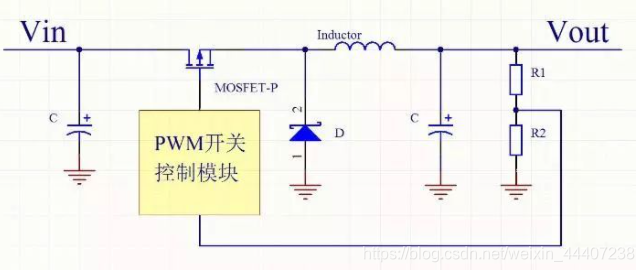

<!--
 * @Author: Connor2Chen 397080067@qq.com
 * @Date: 2024-09-05 16:27:03
 * @LastEditors: Connor2Chen 397080067@qq.com
 * @LastEditTime: 2024-09-05 16:56:38
 * @FilePath: \Learning-Note\02_HardWare\01_模拟部分\01_电源部分理论知识.md
 * @Description: 
 * 
 * Copyright (c) 2024 by ${git_name_email}, All Rights Reserved. 
-->
---

[TOC]

---

# 1.DCDC
>DCDC 分为隔离型和非隔离型,<br>
隔离型：输入与输出的GND无关；<br>
非隔离型：输入输出共用一个地，<br>
多大数都是非隔离型；

## 01.Buck DCDC
### Buck DCDC的理论知识
>这里可以简单理解为降压的一种DCDC



```
对于DCDC来说，不同芯片会有不同的规格参数，
并且相应手册中有不同的原理图推荐，
```
```
说明：
Buck电路中，这里芯片是使用PWM来控制的，
所以需要用到电感和电容进行储能；

并且，由于电感会抑制电流突变，电容也能抑制电压突变，
所以对信号的平滑也起到一定作用；
```
```
对于续流二极管的问题：
我们知道，电感这边的电流是无法突变的，

那么当MOS这边关闭的时候，我们需要一个回路，
让电感中的电流可以"跑"起来，
比如右端到地，再从地到左端~

但是假如直接用导线，那么MOS开启的时候，
会直接短路，炸板子；
于是我们就需要一个正向导通的续流二极管；
```
### Buck DCDC PCB要点
    1.电容要尽量靠近IC；
    2.对于输入与输出的部分，电流可能较大，需要注意铜的量；
    3.注意电源对信号的影响；
<br>
<br>
<br>

## 02.Boost DCDC
>目前没怎么用到，先不写

<br>
<br>
<br>

## 03.同步整流和异步整流


