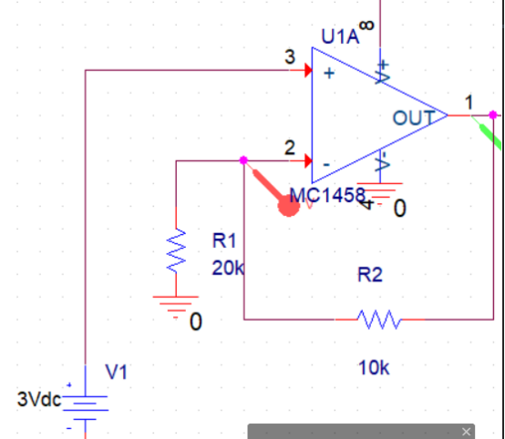

<!--
 * @Author: Connor2Chen 397080067@qq.com
 * @Date: 2024-09-11 11:01:55
 * @LastEditors: Connor2Chen 397080067@qq.com
 * @LastEditTime: 2024-09-11 11:46:22
 * @FilePath: \Learning-Note\02_HardWare\01_模拟部分\02_器件知识.md
 * @Description: 
 * 
 * Copyright (c) 2024 by ${git_name_email}, All Rights Reserved. 
-->

---

[TOC]

---

## 负反馈运算放大器
### 电压增益计算

> 负反馈运算放大器的输出由反馈网络决定， 
> $$A=1+\frac{R_f}{R_{in}}$$
> $V_{out}=V_{in}*(1+\frac{10}{20})=V_{in}*1.5=4.5V$