<!--
 * @Author: Connor2Chen 397080067@qq.com
 * @Date: 2024-09-05 14:59:03
 * @LastEditors: Connor2Chen 397080067@qq.com
 * @LastEditTime: 2024-09-05 15:40:59
 * @FilePath: \Learning-Note\02_HardWare\01_模拟部分\01_常用滤波电路.md
 * @Description:  
 * Copyright (c) 2024 by ${git_name_email}, All Rights Reserved. 
-->
# 常用滤波电路
---

[TOC]

---

>**容抗计算公式**：$X_C = \frac{1}{\omega C} = \frac{1}{2 \pi f C}$

>**感抗计算公式**：$X_L = \omega L = 2 \pi f L$

>**频率计算**：$f = \frac{1}{2 \pi R C}$

>**阻抗计算**: $Z = \frac{1}{2 \pi f C}$

---

## 01.RC滤波电路
### 电容滤波电路 
>适用于负载电路小，并且变化不大的电路中

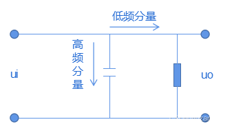
    
    根据傅里叶展开可知：
    非周期性的正弦信号，可以分解成不同频率，不同幅值的正弦信号；
    并且频率越高的交流分量，越容易通过电容，旁路到地；
    除此之外：
    电容可以起到一定平滑电压的作用，具体表现为电容的充放电补偿；    
 

### 一阶RC低通滤波电路
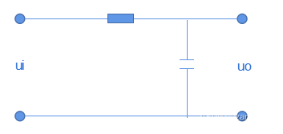
    
    我们根据电容对高频阻抗小的原则可以知道，
    这个的交流高频分量被旁路到了地去。
    我们需要的低频分量顺利到达下级；
 

### 一阶RC高通滤波电路
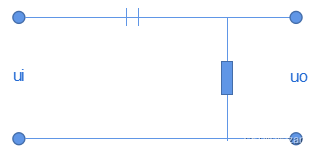
    
    同理，不难看出此时对低频分量起阻碍效果，
    使得高频分量能更好地通过；
 

### RC带通滤波电路
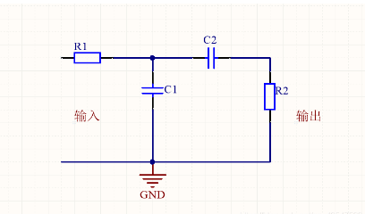
>带通：在一个频段内使信号更好地过去
    
    这里主要依靠C1和C2起到带通作用，
    我们可以简单地理解为：
    C1可以使高出频段的信号旁路到地，
    C2可以使中间频段的信号顺利通过；
 

### RC带阻滤波电路
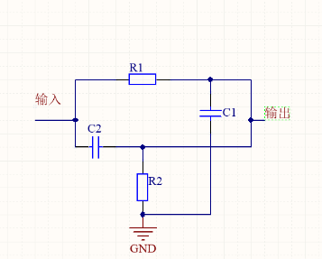
>带阻：对于某个频段信号起到一定阻碍作用

    我们可以简单理解为：
    C1起到一个低通作用，把高频信号旁路到地去，
    C2起到一个高通作用，阻碍低频信号；

---

## 02.RL滤波电路
>RL滤波电路适用于大电流的负载,电感对高频信号的阻碍很大，对低频信号阻碍小;
### 一阶RL低通滤波电路
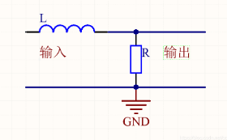
    
    应用了电感对高频信号的阻碍效果；
 

### 一阶RL高通滤波电路
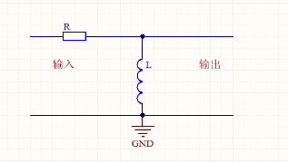

    将低频信号旁路到地；
 

### RL带通滤波电路
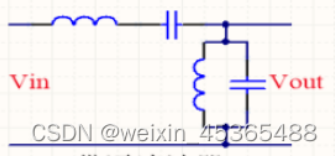
 

### RL带阻滤波电路
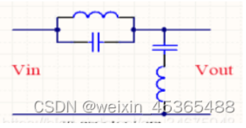

---

## 03. $\pi$型滤波电路
### 低通滤波
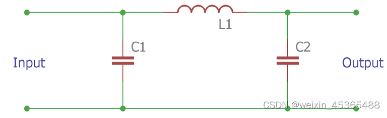

    截止频率fc=/1/?(LC)1/2
    电容值 C=1/Z0 ?fc
    电感值 L1=Z0/ ?fc
    其中 Z0 为阻抗
 

### 高通滤波
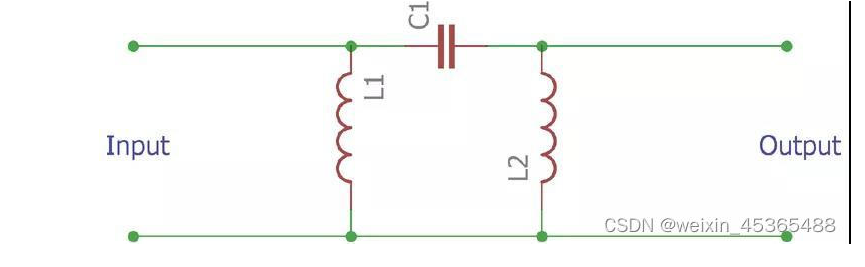

    截止频率 fc= 1/4?(LC)1/2
    电容值 C=1/4Z0?fc
    阻抗值 L1=Z0/4?fc

---
## 04.无源滤波器特点总结
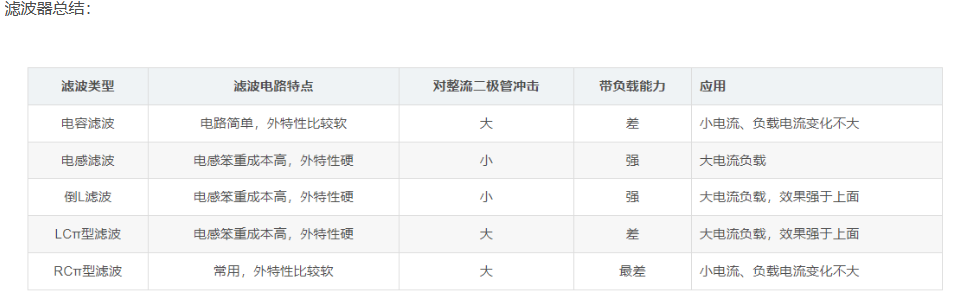
