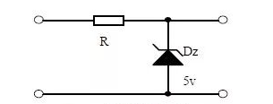
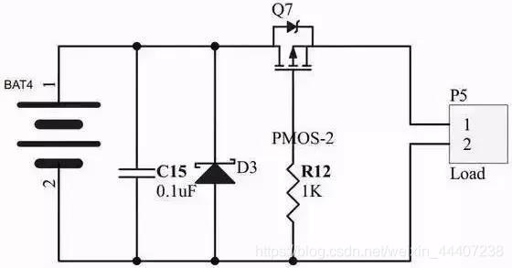
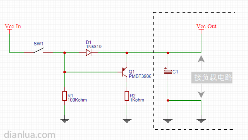
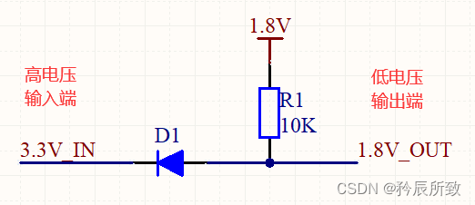
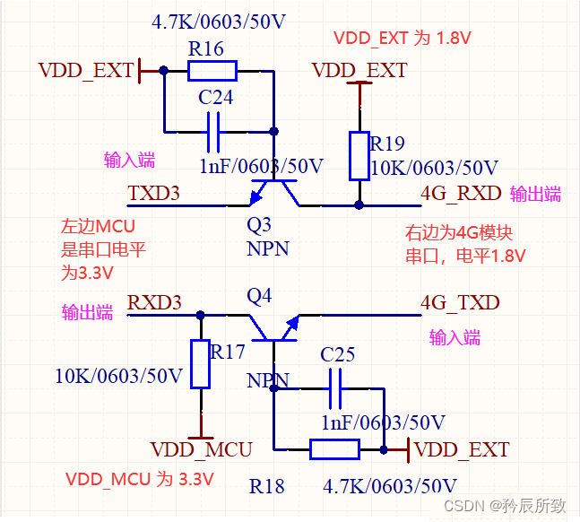
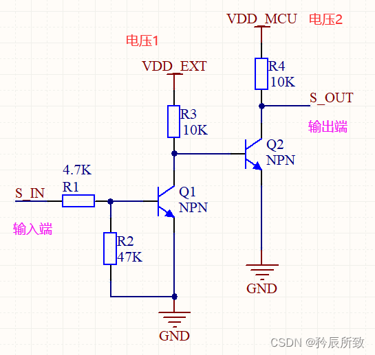
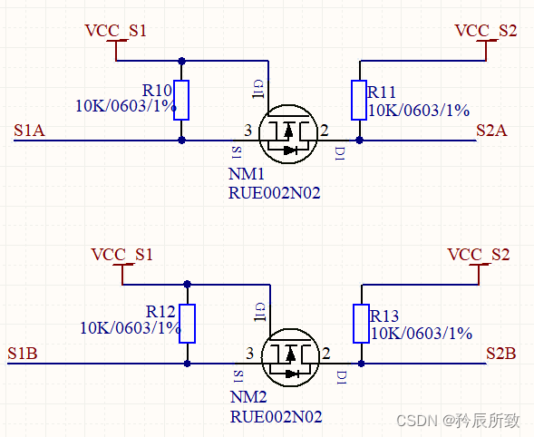

<!--
 * @Author: Connor2Chen 397080067@qq.com
 * @Date: 2024-09-05 15:43:31
 * @LastEditors: Connor2Chen 397080067@qq.com
 * @LastEditTime: 2024-09-05 16:14:58
 * @FilePath: \Learning-Note\02_HardWare\04_常用电路\02_电源与保护电路.md
 * @Description: 
 * Copyright (c) 2024 by ${git_name_email}, All Rights Reserved. 
-->

---

[TOC]

---

# 保护电路
## 一、稳压电路
### 01.二极管稳压电路

    比如Dz是一个5V的稳压二极管，
    当输入过大的时候，Dz就会被击穿，钳位在5V处，
    输出的电压此时就不会涨得太大；

    而前面的电阻主要是为了防止过流用的；
 

## 二、防浪涌电路
>浪涌：某一瞬间的电压突变，可能是打雷，或者是断开感应负载，或者是接入大负载的时候；
### 01.TVS防止静电电路
    这里主要是利用TVS二极管来钳位；
 

## 三、防反接电路
### 01.二极管防反接
    直接采用二极管或者整流桥进行反反接；
    这么做的优点很明显，就是足够简单，方便；
    缺点就是二极管会产生一定的压降；
### 02.PMOS管防反接电路

    
    这里R12是限流保护PMOS的G极，
    电容可以起到一个软启动的作用；

---

# 电源电路
## 一、快速放电电路
>主要解决： 主要用在快速反复开关电源处，且负载电路上有大电容的场景；
负载处有大电容，断电之后，会引起负载电路上电压缓慢下降，这时候如果快速插上电源，
可能导致电路无法正常复位；
### 01.余电快速泄放电路

    主要利用三极管打开与关闭，
    起到快速放电的效果；

 

## 二、电平转换电路
>主要解决: 电路中一些电平不匹配的问题；
### 01.二极管电平转换电路

    当输入端 3.3V_IN 为低电平时，D1导通，
    输出端 1.8V_OUT 为低电平，
    实现两端都为低电平。
    
    当输入端 3.3V_IN 为高电平时，D1截止，
    输出端 被 R1 上拉至 1.8V ，为高电平，
    实现两端都为高电平。

### 02.三极管电平转换电路1

    当输入端为 低电平 0V的时候，三极管导通，
    输出端 与输入端导通，输出端被拉低到接近0V，
    实现两端都为低电平。

    当输入端为 高电平的时候，三极管截止，
    输出端 靠着上拉电阻（上图中的 R17、R19），变成高电平，
    实现两端都被高电平。

### 03.三极管电平转换电路2

    当输入 S_IN 为低电平时，
    三极管 Q1关断，三极管 Q2 基极为高电平，
    导致 Q2 导通，输出端 S_OUT被拉低，
    实现两端都为低电平。

    当输入 S_IN 为高电平 (VDD_EXT) 时，
    三极管 Q1 导通，三极管Q2关断，
    输出端 S_OUT 被 R4 拉高到 VDD_MCU，
    实现两端都为高电平。

### 04.MOS管电平转换电路

    
---
