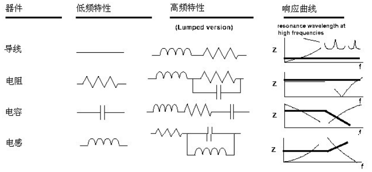
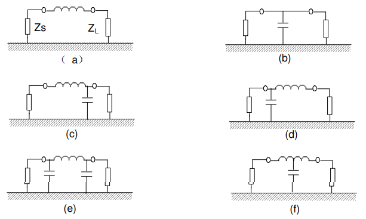

<!--
 * @Author: Connor2Chen 397080067@qq.com
 * @Date: 2024-09-05 17:47:47
 * @LastEditors: Connor2Chen 397080067@qq.com
 * @LastEditTime: 2024-09-09 10:54:18
 * @FilePath: \Learning-Note\02_HardWare\05_电路板部分\01_PCB_EMC_布局.md
 * @Description: 
 * 
 * Copyright (c) 2024 by ${git_name_email}, All Rights Reserved. 
-->
<!--
 * @Author: Connor2Chen 397080067@qq.com
 * @Date: 2024-09-05 17:47:47
 * @LastEditors: Connor2Chen 397080067@qq.com
 * @LastEditTime: 2024-09-09 10:52:03
 * @FilePath: \Learning-Note\02_HardWare\05_电路板部分\01_PCB_EMC_布局.md
 * @Description: 
 * 
 * Copyright (c) 2024 by ${git_name_email}, All Rights Reserved. 
-->

---

[TOC]

---
---
---
---
# 布局
{
# A.层的设置

## 01.层数
### 关于VCC和GND的层数
#### VCC部分
```
假如一块板子只涉及单一电源，那么我们可以直接使用单一电源层；
```
```
假如一块板子涉及了多个电源，我们则需要视电源是否交错来选择层数，
若不交错，那么可以使用 电源层分割；
若交错，那么可以考虑使用多个电源平面；
```
#### GND部分
```
1.元件下面尽量有完整地平面；
2.那些高频、重要信号尽量也需要有相邻地平面（铺地孔）；
3.关键电源处，最好也需要有相邻地平面；
```
<br>

### 信号层数
    NC


## 02.电源层、底层、信号层的相对位置
### VCC、GND 阻抗问题
    可以这样理解：
    就 电源 和 地 来说，它们俩都存在着阻抗，
    并且电源的阻抗 > 地的阻抗；
    那么，我们完全可以在一些接地器件的GND焊盘处，或旁边打地孔
    目的是为了减少发热量；

### 为什么用GND作为参考面
    一般的GND都做了接地处理，那么其屏蔽能力较强；
    用GND来作为基准更为稳定；

### 电源、地、信号相对位置
#### 单板排布原则
    1.元件下面有一个地平面，给器件提供屏蔽，并且给上层提供参考层；
    2.所有信号尽可能与地平面相邻；
    3.尽量要避免两个信号层的直接相邻；
    4.主电源尽可能与其的地平面相邻；


#### 母板排布原则
>适用于50MHZ左右
    
    1.尽量元件层、焊接层那块地平面要完整；
    2.相邻信号层的信号线不要平行；
    3.所有信号层尽量与地平面相邻；

#### 四层板的推荐布局
| 第一层  | 第二层 | 第三层 | 第四层  |
| :-----: | :----: | :----: | :-----: |
| 信号层1 |  GND   | Power  | 信号层2 |

```
用词布局的原因：
1.主要信号在 信号1层走，因为有相邻的地平面进行参考；
2.Power 和 GND 直接相邻，可以创造低分布阻抗的条件，保证去耦效果；
```
#### 六层板的推荐布局
|   1   |   2   |   3   |   4   |   5   |   6   |
| :---: | :---: | :---: | :---: | :---: | :---: |
|  S1   | GND1  |  S2   | POWER | GND2  |  S3   |

#### 六层板往上的价格昂贵，不多用；


<br>
<br>
<br>
<br>
<br>


---
# B.模块划分、特殊器件布局
## 1.模块划分
### 按功能划分
    说白了就是实现不同功能，比如 某个雷达模块、某个DCDC模块等；
### 按频率划分
    分为高中低三种不同频率，尽量互不交错；
>高频信号：一般指**几十Mhz到Ghz级别**，一般是在无线通信上，需要严格控制阻抗；

>中频信号：一般指**几百Khz到几十Mhz这个级别**

>低频信号：一般指**几百Khz往下的**

### 按信号类型划分
    可以分为数字信号和模拟信号，
    数字信号会对模拟信号造成干扰，比如一些开关噪声等；
    
    所以我们需要将两部分区域划分开来，从空间上我们做好必要的隔离。
    那种A/D转换部分，我们可以放在两者相交的地方；

### 关于综合布局
    1.首先，应该按照信号流向，让高速信号走最短路径；

    2.时钟线也尽量走短，假如无法走短路径，需要在时钟线两边加屏蔽地线；
    时钟电路高频开关，容易对外接造成影响，布局时可以尽量躲开;
    
    3.基准电压尽量远离数字信号，或者干扰源；

    4.晶振、晶体可以靠近IC放置；

<br>

## 2.特殊器件的布局
### 电源部分
    现在很多板子都会使用DCDC，同样的这样的开关电源会造成干扰，
    甚至干扰频带可以达到300Mhz以上。
    
    在布局时，可以把DCDC放在电源输入部分，直接转换；
    也可以考虑用过孔带与其它电路分割开；（实际产品中很少使用）

    在做子母板的时候，需要考虑到共模干扰；

>共模干扰：我比较浅显地认知是，开关电源会通过输入端，对参考平面进行干扰，从而影响到信号；

### 时钟部分
    时钟部分因为高频切换，所以干扰源挺大。
    在做子母板的时候，可以尽量远离连接处；

### 电感线圈
    电感线圈下方尽量不要走高速、重要信号；

### 滤波器件
    1.去耦电容尽量放在IC引脚附近；
    2.电源滤波尽量靠近电源输入输出部分；


<br>
<br>
<br>
<br>
<br>

---
# C.滤波
## 1.概述
    首先电源回路中存在 寄生电感 和 等效电容；
>寄生电感：过孔，导线等都会产生。并且过孔越长，寄生电感越大；<br>
>等效电容：走线、GND与VCC之间都会存在；
    
    再回到滤波问题，比如某个IC中，当某处IC从0变到1的时候。
    需要 VCC 来供电，此时从0跳变到1，那么会在等效电感上产生一定的电势差；

$$
▲V = L \frac{Dl}{Dt}
$$

    这个电势差表现为一定的尖峰脉冲，会对电路造成一些干扰；
    以及作为辐射源；
<br>
    
    因为这个等效电感和导线成正相关，那么我们完全可以在这个IC附近加一个电容；
    IC需要进行电压跳变的时候，由这个电容进行充放电，减小等效电感带来的干扰；

## 2.滤波器件
    常见的有电感、电容、磁珠、电阻；
    其中电阻本身不具滤波特性，作为辅助；
### 低频率下各个器件呈现特性

>电感这边存在一个自谐振频率$f_c$,<br>
当频率低于$f_c$的时候呈现感性；
当频率高于$f_c$的时候呈现容性；

#### 磁珠
    磁珠可以视为电阻与电感串联；主要用于抑制差模噪声；
    当低频时，电流顺利流过；
    高频时，电流受到很大阻碍，大部分变成热；

#### 共模电感
    主要用于抑制导线对地的高频噪声；
## 3.滤波电路
### 滤波电路形式
    因为滤波电路中，主要都是滤除或者说消耗掉高频，
    所以大部分滤波电路表现为 低通滤波器 形式；



>(a) 电感滤波器：适用高频，源阻抗小、负载阻抗小；<br>
>(b) 电容滤波器：适用高频，源阻抗大，负载阻抗大；<br>
>(c) $Γ$型滤波器1：适用高频，源阻抗小，负载阻抗大；<br>
>(d) $Γ$型滤波器2：适用高频，源阻抗大，负载阻抗小；<br>
>(e) $\pi$型滤波器：适用高频，源阻抗大，负载阻抗大；<br>
>(f) $T$型滤波器：适用高频，源阻抗小，负载阻抗小；<br>

### 滤波电路的布局、走线
>1.滤波电路的地需要低阻抗，最好不同功能不存在共地阻抗；<br>
>2.滤波电路输入输出不交叉走线；<br>
>3.滤波电容走线短，减小等效电感、电阻 ---> 这也就是为啥放IC旁原因；
>4.有插件时，滤波电路靠近插件；

## 4.电容在PCB的EMC应用
### 滤波电容种类
> **去耦：** 减小系统和接口间的耦合；<br>
> **旁路：** 在一些会产生瞬态能量的地方，给到一个低阻抗通路；<br>
> **储能**

### 电容自谐振
    实际中，电容其实是 电容、电感、电阻 组合成的一个系统（由于寄生）；
    多层电容器在PCB中，通常会有一个5nH，30mR的阻抗，
    所以实际上表现为 带通滤波器；
    
    并且多个电容并联，在某个频率下阻抗会达到一个峰值，
    具体可以查询多个电容的谐振问题；

### ESR对并联电容幅值特性的影响
    阻抗峰值 与 ESR成反比；

>1.ESR减小，谐振点电阻抗减少，反谐振点阻抗增大；<br>
>2.n个相同电容并联的时候，最小阻抗可能小于$\frac{ESR}{n}$;<br>
>3.多个电容并联，阻抗不一定发生在谐振点；<br>
>4.可以试试电容值均匀分布展开；<br>

### 电容ESL的选择
    尽量选用ESL小的电容；

### 电容的选择
    1.对于RF来说，可以用陶瓷电容、聚酯纤维电容、聚苯乙烯薄膜电容；
    2.对于滤波来说，可以用X7R、Y5V、Z5U等松散介质电容；

    PS：板极频率高于50Mhz，可以多用0.01uf电容，而不是目前常用的0.1uf；

### 去耦、旁路设计建议
    1.要注意自谐振特性；
    2.在所需要的频率范围内多加电容；
    3.靠近IC；
    4.旁路电容尽可能放在IC一个平面内；
    5.对于多时钟IC，可以把电容VCC处分割开（不用全黏在一起）；
    6.对于时钟频率宽的IC，可以把两个容值接近2：1的电容并联放置；

### 储能电容的设计
    1.板级储能电容：高频高速单板可以用较大容值(1~22uf)的钽电容，
    让负载很重的时候电压不会严重下跌；

    2.器件级储能电容：应对与高频高数，功耗损耗很大的器件。
    可以并联1~4个较大容值（1~22uf）的钽电容，
    这样负载很重的时候，器件周围电压可以保持正常；


<br>
<br>
<br>
<br>
<br>

---
# D.地的分割与汇接
## 1.接地与接大地
    接地：接入基准地（信号地）；
    接大地：接入地球地（保护地）；

    地与大地相连：
    1.保护操作人员；
    2.静电泄放；
    3.提高稳定性
## 2.接地的形式
### 单点接地
    单点接地也可以说是把所有要接地部分，全连接到一个点上去；

    适用电源电路，或者较低频率（1Mhz）以下电路中使用；

    系统工作频率高，以致波长与系统接地引线长度可以比拟时，不能用单点接地；
>单点接地时，一般地引线长度需要小于$\frac{1}{20}$的波长；

### 多点接地
    多点接地，也就是把要接地的点接入最近的地平面，也是现在常用的；

    可以适用于高频，

    但是多点接地会造成许多接地环路，对抵抗外界电磁干扰能力差点；

> **地线回路的电磁干扰：**
> <br>
> 由于地平面也存在等效电感、电阻，<br>
> 那么流过地平面的电流会产生一定的压降；<br>
> 这个压降会改变到地端点部分，再耦合到负载处，造成地回路EMI；<br>

### 浮空地
    NC


---

