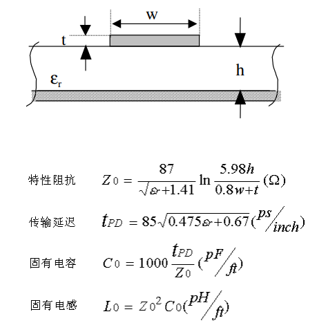
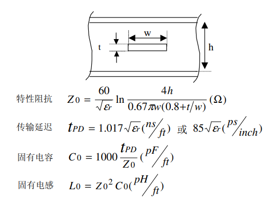

---

[TOC]

---

# 布线
---
# A.传输线模型、反射、串扰
## 01.概述
> **传输线：** 布线长度大于$\frac{1}{20}$波长，或者信号延时大于$\frac{1}{6}$上升沿时，这种布线可以称为传输线； 
> **传输线种类：** 微带线、带状线；

## 02.传输线种类
### 微带线
    定义：与参考平面相邻的表层布线；

>比如我们常用的FR-4中，$ε_r$=4.5 
>传输延迟 TPD=142.2(ps/inch)

### 带状线
    定义：在两个参考平面之间的线

> FR-4中，$ε_r$=4.5 
> 传输延迟 TPD=180.3(ps/inch)

### 嵌入式微带线
    NC

## 03.传输线的反射
### 定义
>信号在传输过程中的**任何**不均匀的变化（如转弯、阻抗改变）都会引起反射， 
反射对模拟信号表现为驻波，对数字信号表现为振铃和过冲； 
这些过冲一方面造成干扰 ，另一方面可能会造成后级部分器件因耐压损坏；

    一般来说，需要对超过正常电压0.7V的过冲作措施；

    所以也得注意好阻抗匹配；
#### 驻波
    频率相同，传输方向相反；

#### 过冲
    分为上下过冲，波形看上去就像山峰和低谷；

#### 振铃
    上下起伏摆动，幅值越来越小；

## 04.串扰
### 定义
>在两根信号线之间，由于寄生电容$C_sv$的影响， 
存在高速信号对于脉冲边沿信号相互影响的情况；

    串扰因数：
    1.耦合长度L --- 信号线之间的距离；
    2.源端、负载端输入输出阻抗；
    3.介电常数；
    4.传输线宽度W、厚度T、高度H；

---

# B.优选的布线层
## 01.表层、内层走线比较
> **微带线：** 表层； 
> **带状线：** 内层； 

    1.微带线比带状线延时低；
    2.微带线固有电容比带状线小；
    3.微带线之间对外辐射，带状线有屏蔽层；

### 对于干扰的考虑
    1.带状线由于在内层，而且被屏蔽层夹着，所以辐射能被控制住，
    所以微带线对外干扰主要表现在：
    a.电源、地的纹波；
    b.相邻走线串扰；

    2.布线时关注：
    a.强信号，高速，高频对外的辐射；
    b.弱信号，小信号，易受外界干扰，如复位信号；
    c.比如复位信号和高速信号，优先布局在内层。而且复位信号最好远离高速信号；

## 02.布线层优先级别
    1.优先内层；
    2.无相邻布线层 / 有相邻布线层，但是没有平行信号；
    3.内层布线优先 G-G > G-P > P-P;
    4.别走分割区;

---
# C.阻抗控制
    未完待续...

