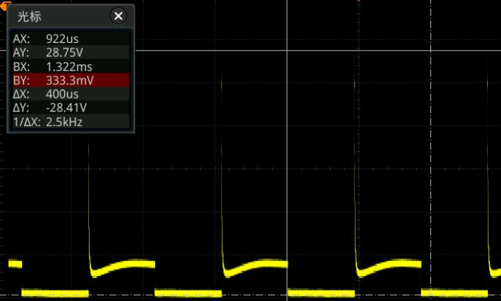
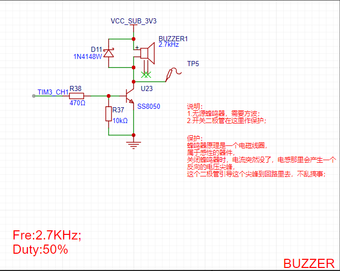

<!--
 * @Author: Connor2Chen 397080067@qq.com
 * @Date: 2024-09-05 17:02:24
 * @LastEditors: Connor2Chen 397080067@qq.com
 * @LastEditTime: 2024-10-21 09:15:14
 * @FilePath: \Learning-Note\03_Issue Tracking\01_Hard_Issue.md
 * @Description: 
 * 
 * Copyright (c) 2024 by ${git_name_email}, All Rights Reserved. 
-->

---

[TOC]

---
---

# 芯片使用问题
## 1.注意国产器件
```
问题的引出：
在给Cerberus_Sub_Controller_v01上电的时候，发生先是二极管烧毁，然后是LDO烧毁。
在第一次复查后，再次上电，导致ESP12F也烧毁；
```
```
问题的探讨：
这次问题认为是二极管的整流电流选型方面出现问题，
第二个就是AMS1117-3.3不是一种牌子，而是一种型号。
在淘宝买的两款，一款耐压为18V，另一款耐压最大为7.5V。
PS：本次上电的电压为12V，故造成烧毁。
```
```
问题的拓展：
在询问廖工的过程中得知，
国产芯片存在部分参数会虚标的问题，
所以在选型的时候，需要注意好冗余量的把握；
```

<br>
<br>
<br>

## 2.关于AMS1117-3.3S压差问题
```
问题引出：在焊接完Cerberus_Sub_Controller_v0.1后，上电后，发现LDO烧毁；
```
```
问题排查：
首先我怀疑是电路中某部分焊接问题，但是在新的板子测通断后，发现并没有短路；
之后怀疑是LDO耐压值问题，但是手册中耐压值为18V>12V，
并且在只留 LDO 这部分电路的情况下，可以正常工作；
最后定位到ESP12F工作需要大电流的情况；
```
```
问题结论：
根据伙伴（dumbass）提醒下，了解到手册内容和实际存在差异；

dumbass 的硕导告诉他的是，LDO压差超过7V容易烧毁，
并且AMS1117-3.3S 在压差过大时，输出电流会变小；

可知：ESP12F需要大电流，而12V-3.3V的压差较大,
加上压差超过7V，于是乎造成了烧毁；
```

<br>
<br>
<br>

## 3.关于蜂鸣器的尖峰脉冲问题

```
反向电动势的问题引出：
在使用蜂鸣器的时候，因为电磁蜂鸣器为感性器件，
所以在关闭的时候，会因为电感阻止电流突然断开，产生一个反向电动势，
```

<br>

```
反向电动势危害：
这种反向电动势引入电路，容易造成电路的损害；
```


```
采取策略：
我们完全可以在电磁蜂鸣器的两端并联一个二极管，图中的D11所示。
它的具体作用是，在产生反向电动势的时候，电流会被二极管引导，
从二极管正极再流向蜂鸣器的正极部分，从而抑制这个反向电动势；
```

<br>
<br>
<br>

## 4.注意LDO是否是固定输出电压
```
问题引出: 
Cyberus控制板v0.2 在焊接好之后, 
上电, LDO输出不为3V3, PER_3V3_LED烧坏
```
```
问题排查:
SRAM STM32 被烧坏, LDO固定输出部分被加了分压网络
```
```
结论:
下次切忌粗心大意,
原理图多检查几遍,
焊接时需要一级一级往下焊, 先开始电源部分, 电源输出正常后再到模块;
```

<br>
<br>
<br>

---

# PCB的问题
## 走线宽度与电流有关
```
问题引出：之前在创高工作时，被告知PCB的宽度与电压有关；
```
```
问题发现：后续发现，PCB的宽度应该与流过该电路的电流有关；
```
```
问题拓展：
除了这里，还有些部分需要解释 ---> PCB中横截面积可以决定其电阻大小，
宽的走线，自然可以使电阻变小，

从而根据 P=I?R得知发热量降低；那么我们可以根据这里提到的，

在走一些大电流的时候，进行合理的开窗，后续再将焊锡加上去，增加这部分的厚度；
从而提高电路横截面积，增大带载能力；

```


