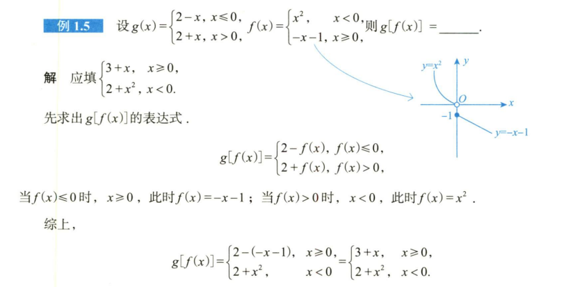

<!--
 * @Author: Connor.C 397080067@qq.com
 * @Date: 2024-09-20 09:29:31
 * @LastEditors: Connor.C 397080067@qq.com
 * @LastEditTime: 2024-09-20 09:32:00
 * @FilePath: \Learning-Note\05_CSLG\01_数学\错题分析.md
 * @Description: 
 * 
 * Copyright (c) 2024 by ${git_name_email}, All Rights Reserved. 
-->

---

[TOC]

---

# 高数部分
## 例题部分
### 1.复合函数例题
#### a.

> **错误分析：** 
> 太想当然，这里应该先确定好外部函数的定义域$D_1$, 
> 用外部函数定义域来确定用哪个内部函数; 
>

