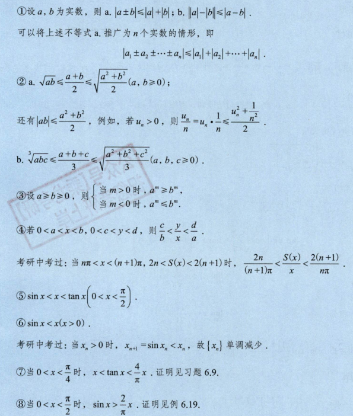

<!--
 * @Author: Connor2Chen 397080067@qq.com
 * @Date: 2024-09-09 21:39:00
 * @LastEditors: Connor2Chen 397080067@qq.com
 * @LastEditTime: 2024-09-30 11:38:28
 * @FilePath: \Learning-Note\05_CSLG\01_数学\高数提取知识点.md
 * @Description: 
 * 
 * Copyright (c) 2024 by ${git_name_email}, All Rights Reserved. 
-->

---

[TOC]

---
# 一、函数极限与连续
## 01.函数的概念与性质
### a.函数定义
> **简单定义部分** 
> 首先x,y是两个变量, 
> D是一个数集，对于x来说，每一个x∈D，并且按照一定法则f， 
> 总是有一个确定的y与x对应， 
> 则称y为x的函数， 
> 记作：y=f(x), 
> 这里的x就称为自变量，y称为因变量，这个D就是定义域； 

> **单值函数与多值函数** 
> 可以简单理解为： 
> 单值函数就是x与y一 一对应， 
> 而多值函数就是多个x对应一个y, 

### b.反函数
> **定义部分** 
> 函数y=f(x)的定义域为D，值域为R； 
> 如果对于每个在R之间的y来说，都存在**唯一**的x∈D，使得y=f(x)， 
> 那么我们可以将它们倒过来，变成 x=a(y)这种形式，那么这个函数就可以说是y=f(x)的反函数，记作$x=f^{-1}(y)$, 
> 此时它们定义域与值域对调； 

> **一些性质** 
> 1.严格单调的函数必有反函数（一一对应）； 
> 2.直接函数 与 反函数 关于 $y=x$轴对称； 
> 3.有反函数的函数也不一定是单调函数， 
> 比如 
> $f(x)=x,x>=0;$
>  $\frac{1}{x},x<0;$

### c.复合函数
>  **定义部分** 
> 可以见到理解为 $y=f(u)$ 这个外函数定义域为$D_1$, 
> 然后 $u=g(x)$这个内函数定义域为$D$, 
> 那么可以认为 $y=f[g(x)],x∈D$ 这个复合函数的定义域为$D$,其中$u$称为中间变量; 
>
> **PS：** 在多段函数的时候，根据外部函数的定义域来确定内部函数的选择;

### d.隐函数
> **定义部分** 
> 关于隐函数，我理解为是类似没有明确表达 $x与y$ 的关系的一个函数， 
> 可以用如 $F(x)=0$ 来表示, 
> 比如 $x^2+y^2=1$ 也是一个隐函数，它没有直接说明$x与y$的关系， 
> 但其实这个关系，我们是可以推出的。 
>

### e.函数的四种特性
#### 有界性
> **从定义上说**,也就是 $f(x)$ 中  
> $x∈D$，**(这里规定了定义域)**; 
> 又有一个 $I∈D$, **(这里规定了这个$I$落在定义域内)**; 
> 此时对于任一 $x∈I$,有$|f(x)|≤M$, **用M把这个函数上下界定死** 
> 此时说这个函数在$I$上有界，反之; 

#### 单调性
> **从定义上说**,还是一样,确定一个$f(x),而且x定义域为D$，然后存在$I属于D$; 
> 这时有$x_1,x_2$， 
> 这时候 $x_1,x_2$与$f(x_1),f(x_2)$的大小关系成正比，那么单增; 
> 假如大小关系成反比,那么单减; 

> **一种方法**
>  

#### 奇偶性
> 关于定义方面略,这里注意下定义域关于原点对称; 
> **然后就是：** 
> 偶函数图像关于y轴对称, 
> 奇函数图像关于原点对称; 
> **PS:** 
> $f(x)+f(-x)必然是偶函数$ 
> $f(x)-f(-x)必然是奇函数$ 
> 对于复合函数来讲,内偶则偶，内奇同外; 
> 假如$f(x)为奇函数，那它一阶导为偶，二阶导为奇...$,积分反之 
> 对任何$x,y$都有$f(x+y)=f(x)+f(y)$,那么f(x)为奇函数; 
> 为奇函数; 

#### 周期性
> 定义略; 
> **重要结论:** 
> 1.假如 $f(x)$ 以T为周期,那么$f(ax+b)$以$\frac{T}{|a|}$为周期;  
> 2.对于复合函数来说，假如内函数是周期函数，那么整个复合函数也是周期函数;  
> 3.假如函数$f(x)$可导，且周期为T;那么它的一阶导函数周期也为T;  

 
 
 

# 二、数列极限
## 1.数列的概念
> 没啥记的,就是数列从小到大,然后第N项为一般项; 
>  
> **子列：** 也就是把数列A从拆出n个元素组成一个新数列;  
> **等差数列:**  
> 首项$a_1$,公差$d$,则: 
> $a_n=a_1+(n-1)d$ 
> $S_n=\frac{n}{2}*[2a_1+(n-1)d]=a_1n+\frac{n(n-1)d}{2}=\frac{n(a_1+a_n)}{2}$  
> **等比数列:** 
> 首项$a_1$,公比$r$,则:
> $a_n=a_1*r^{n-1}$  
> 当r=1时,$S_n=na_1$; 
> 当r≠1时,$S_n=\frac{a_1(1-r^n)}{1-r}$
>  
>  
> **单调数列:** 
> 后一项比前一项大(小),单调递增(减)数列; 
>  
>  
> **有界数列:** 顾名思义; 
>  
>  
> **常见数列前N项和:** 
> 
>  
>  
> **$(1+\frac{1}{n})^n$数列结论:** 
> 

 

## 2.数列极限的定义

**定义部分:** 

> 这里他说得非常复杂恶心,其实可以这样看; 
> ε主要用来表述一个很小的数,能多小？小到仅仅大于0; 
> 然后$a$在这里表示极限, 
> 那么就可以理解为$x_n$与$a$之间的差非常小，小到比ε还小, 
>  
> 上述这样成立的话，就说明这个数列有极限;

**定理一:** 
> 数列收敛，子数列也收敛，并且收敛到同一极限; 
> 于是可以推理出： 
> 子数列发散，数列发散; 
> 两个子数列不收敛到同一值,数列发散; 

 

## 3.收敛数列的性质 
> **定理二(唯一性):** 
>  
> 也就是给出数列的极限存在，那么极限是唯一的; 
>
> **定理三(有界性):** 
>  
> **这里有异议**假如极限为无穷，这个数列不是无界的吗？ 
>
> **定理四(保号性):** 
>  
> 说的就是数列x极限大于b,那么绝对存在某一项开始都大于b, 
> 这个很好理解,假设数列$x$的极限为$a$吧, 
> a和b之间绝对是有一段距离的,不论多小都是有的,不然就变成a=b了; 
>
  

## 4.极限四则运算规则
  
 

## 5.海涅定理(归结原则) 
> 也就是函数$f(x)$在$x_0$点处有极限$L$,  
> 那么对于趋近于这个点$x_0$组成的数列$x_n$来说,  
> $f(x_n)$的极限值也趋向$L$;  
> *这个定理主要是作为函数极限与数列极限转换的桥梁* 
>
## 6.夹逼准则 
>  
> 这个很好理解，不多赘述; 
 

## PS.放缩的常用方式 
> (1) **简单的放大和缩小:** 
 
> (2) **利用重要的不等式:** 
 
 
> (3) **封闭空间上连续函数必有最大最小值** 
> (4) **压缩映射原理:** 
>  
> (5) 例题2.10可以看看  

## 7.单调有界准则 
> 也就是**单调**、**有界**函数必有极限(极限就是那个界); 
> 那么问题重点就放在如何知道单调, 

## PS.数列单调性证明: 
> a.利用$x_{n+1}-x_n$ 或者 $\frac{x_{n+1}}{x_n}$来确定; 
> b.导 

 
 

# 三、一元函数微分学的概念
## 1.导数
### 导数定义部分
> 首先就是导数的定义,$y=f(x)$定义域为$I$,  
> 
> 然后,有$x_0和x_0+Δx$都落在定义域$I$上面, 
> 还有就是 $x=x_o+Δx$ , $y=f(x)=f(x_o+Δx);$ 
> 那么我们可以知道$Δy=f(x)-f(x_0)$  
> 
> **假如**当$Δx$趋近于0时, $\frac{Δy}{Δx}$存在,则说明这个函数在$x_0$处可导; 
> 并且称这个极限为$y=f(x)$在$x_0$处的导数, 
>  
>
### 导数意义
> 导数的引进，我认为主要是把连续的变成离散的,比如某点的瞬时速度, 
> 我们只有连续的时间,我们想知道某个时刻的瞬时速度, 
> 那就要用导数思想,作出一个Δt，把时间逼近,这时候可以知道ΔS,也就是路程, 
> 这时候这个时间点的导,也就是这个点的瞬时速度; 

### 一些性质
> **函数在某点可导的冲要条件:**  
> 单侧导数 
>  
> 函数在某点可导的冲要条件为,左右导数存在且相等; 
>
> **函数在一点可导的必要条件:** 
> $f(x)$在某点可导,则其在某点必连续; 
> 也就是可导必连续,连续不一定可导; 
> 