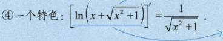

<!--
 * @Author: Connor2Chen 397080067@qq.com
 * @Date: 2024-09-09 21:39:00
 * @LastEditors: Connor.C 397080067@qq.com
 * @LastEditTime: 2024-09-20 20:47:07
 * @FilePath: \Learning-Note\05_CSLG\01_数学\高数知识点.md
 * @Description: 
 * 
 * Copyright (c) 2024 by ${git_name_email}, All Rights Reserved. 
-->

---

[TOC]

---
# 一、函数极限与连续
## 01.函数的概念与性质
### a.函数定义
> **简单定义部分** 
> 首先x,y是两个变量, 
> D是一个数集，对于x来说，每一个x∈D，并且按照一定法则f， 
> 总是有一个确定的y与x对应， 
> 则称y为x的函数， 
> 记作：y=f(x), 
> 这里的x就称为自变量，y称为因变量，这个D就是定义域； 

> **单值函数与多值函数** 
> 可以简单理解为： 
> 单值函数就是x与y一 一对应， 
> 而多值函数就是多个x对应一个y, 

### b.反函数
> **定义部分** 
> 函数y=f(x)的定义域为D，值域为R； 
> 如果对于每个在R之间的y来说，都存在**唯一**的x∈D，使得y=f(x)， 
> 那么我们可以将它们倒过来，变成 x=a(y)这种形式，那么这个函数就可以说是y=f(x)的反函数，记作$x=f^{-1}(y)$, 
> 此时它们定义域与值域对调； 

> **一些性质** 
> 1.严格单调的函数必有反函数（一一对应）； 
> 2.直接函数 与 反函数 关于 $y=x$轴对称； 
> 3.有反函数的函数也不一定是单调函数， 
> 比如 
> $f(x)=x,x>=0;$
>  $\frac{1}{x},x<0;$

### c.复合函数
>  **定义部分** 
> 可以见到理解为 $y=f(u)$ 这个外函数定义域为$D_1$, 
> 然后 $u=g(x)$这个内函数定义域为$D$, 
> 那么可以认为 $y=f[g(x)],x∈D$ 这个复合函数的定义域为$D$,其中$u$称为中间变量; 
>
> **PS：** 在多段函数的时候，根据外部函数的定义域来确定内部函数的选择;

### d.隐函数
> **定义部分** 
> 关于隐函数，我理解为是类似没有明确表达 $x与y$ 的关系的一个函数， 
> 可以用如 $F(x)=0$ 来表示, 
> 比如 $x^2+y^2=1$ 也是一个隐函数，它没有直接说明$x与y$的关系， 
> 但其实这个关系，我们是可以推出的。 
>

### e.函数的四种特性
#### 有界性
> **从定义上说**,也就是 $f(x)$ 中  
> $x∈D$，**(这里规定了定义域)**; 
> 又有一个 $I∈D$, **(这里规定了这个$I$落在定义域内)**; 
> 此时对于任一 $x∈I$,有$|f(x)|≤M$, **用M把这个函数上下界定死** 
> 此时说这个函数在$I$上有界，反之; 

#### 单调性
> **从定义上说**,还是一样,确定一个$f(x),而且x定义域为D$，然后存在$I属于D$; 
> 这时有$x_1,x_2$， 
> 这时候 $x_1,x_2$与$f(x_1),f(x_2)$的大小关系成正比，那么单增; 
> 假如大小关系成反比,那么单减; 

> **一种方法**
>  

#### 奇偶性
> 关于定义方面略,这里注意下定义域关于原点对称; 
> **然后就是：** 
> 偶函数图像关于y轴对称, 
> 奇函数图像关于原点对称; 
> **PS:** 
> $f(x)+f(-x)必然是偶函数$ 
> $f(x)-f(-x)必然是奇函数$ 
> 对于复合函数来讲,内偶则偶，内奇同外; 
> 假如$f(x)为奇函数，那它一阶导为偶，二阶导为奇...$,积分反之 
> 对任何$x,y$都有$f(x+y)=f(x)+f(y)$,那么f(x)为奇函数; 
> 为奇函数; 

#### 周期性
> 定义略; 
> **重要结论:** 
> 1.假如 $f(x)$ 以T为周期,那么$f(ax+b)$以$\frac{T}{|a|}$为周期;  
> 2.对于复合函数来说，假如内函数是周期函数，那么整个复合函数也是周期函数;  
> 3.假如函数$f(x)$可导，且周期为T;那么它的一阶导函数周期也为T;  

 
 
 

# 二、函数的图像
## 1.基本初等函数与之图像
