<!--
 * @Author: Connor2Chen 397080067@qq.com
 * @Date: 2024-10-09 16:33:41
 * @LastEditors: Connor2Chen 397080067@qq.com
 * @LastEditTime: 2024-10-10 13:37:19
 * @FilePath: \Learning-Note\05_CSLG\02_微机原理\单片机与接口技术.md
 * @Description: 
 * 
 * Copyright (c) 2024 by ${git_name_email}, All Rights Reserved. 
-->
 

---

[TOC]

---

# 第一章 微机基础知识
## 1.1 微处理器、微机和单片机概念
> **微处理器:** 微处理器一般表现为芯片，它本身不算是计算机，负责微型计算器处理、控制部分;
> 它由控制器、运算器、和多个寄存器组成; 
> **微机:** 属于计算机，除了有微处理器作为CPU外，还有存储器、接口适配器、IO设备等; 
> **单片机:** 属于微机+定时器电路等的组合; 
>

 

> **微处理器(机)的组成:**
> 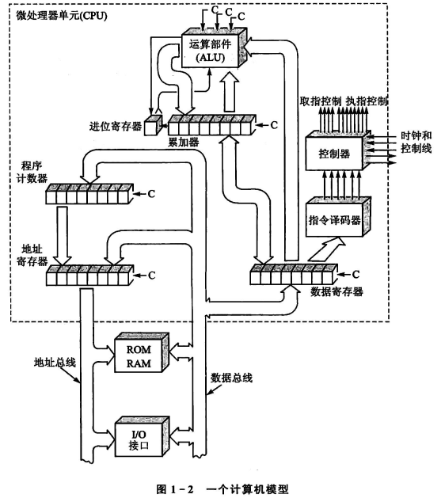
>  
> **1.运算器:** 
> <u>组成:</u> 运算器主要由算数逻辑单元(ALU)、累加器、寄存器等部分组成; 
> <u>作用:</u> 顾名思义,把传输到微处理器的数据进行算术或者逻辑运算; 
> <u>ALU主要输入来源:</u> 累加器、数据寄存器; 
> ALU进行不同运算操作是由不同控制线上信号决定的; 
> <u>操作数:</u> 对于8位单片机,ALU接收到来自累加器、数据寄存器的两份8位二进制数,因为要对这些数据进行操作，故称为操作数; 
> 
>  
> 
> **2.控制器:** 
> <u>组成:</u> 由程序计数器、指令寄存器、指令译码器、时序发生器和操作控制器等组成; 
> <u>作用:</u> 主要用于协调调度,主要如 1.从内存里取出一条指令,并且指出下一条指令在内存中的位置; 2.对指令进行译码或者测试,产生相应的操作控制信号; 3.指挥并控制CPU、内存和输入/输出设备之间数据流动的方向; 
>  
>  
> **3.CPU中的主要寄存器:**  
> <u>a.累加器(A):</u> 作用有点类似一个缓存,计算前提供操作数,计算后保存计算结果; 
> <u>b.数据寄存器(DR):</u>  可以通过数据总线,来对存储器或者输入输出设备进行数据暂存的单元;比如保存一条正在译码的指令,或者是送往存储器的数据字节; 
> <u>c.指令寄存器(IR)与指令译码器(ID): </u>  IR用来保存当前正在执行的指令,当一条指令执行的时候,流程是这样 (内存->数据寄存器->指令寄存器) ; 指令分为操作码字段 和 地址码字段, 都是二进制的 ; ID 主要是用于"翻译操作码字段",以便告诉机器需要进行什么操作; 
> <u>d.程序计数器(PC):</u> 单片机需要根据程序地址执行程序,这时候PC寄存器作用就显现出来 , 比如执行完第一条程序,这时候PC寄存器会指向第二条程序的地址, 这样机器就知道下一步执行什么程序 ; 并且由于一般程序是按顺序进行，所以很多时候都是+1; 
> <u>e.地址寄存器(AR):</u> 这个寄存器主要作用就是用来保持当前通信设备地址,可以是内部的存储单元,也可以是外部的IO设备; 

 
 

> **存储器和输入输出接口:** 
> **1.存储器:** 
> 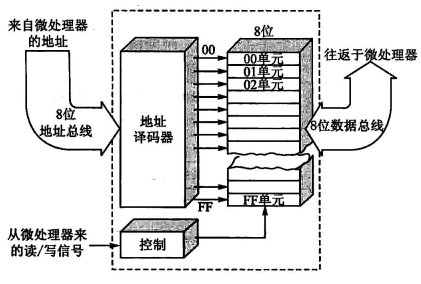 
> 这是一个256x8位存储器,  
> 其中利用8位地址总线确定需要对哪个单元进行操作, 
> 并且可以利用控制信号来控制读写, 
> 数据通过8位数据总线来进行传递; 
>  
>  
> **2.I/O接口及外设:** 
> IO口对应的外设也有个固定地址, 也就是设备地址;

 
 

## 1.2 微机的工作过程
> **直接寻址:**  
> 类似下列的寻址方式,在操作码后跟上操作数的地址;

    LDA 23

 

> **1.执行指令顺序:** 
> 取指 -> 译指 -> 执指 , 反复执行; 
>  
> **2.执行指令过程:** 
> 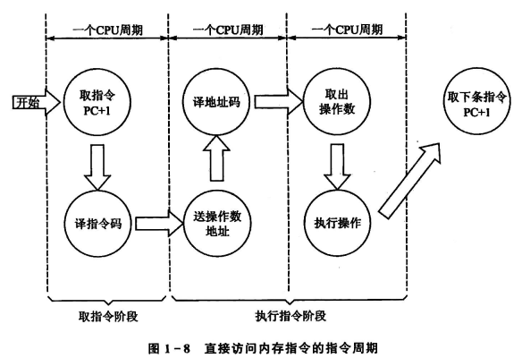 
> 这是直接寻址方式, 这里占了三个机器周期, 
> 第一个就是取指令然后译指令码; 
> 第二个是在知道指令为LDA后, 把操作数地址给到译地址码处; 
> 第三个是知道地址后, 取出操作数执行操作; 
>  
> **3.执行一个程序的过程:** 
> 这里用LDA 23来做演示, 其中存储单元23中操作数为7; 
> 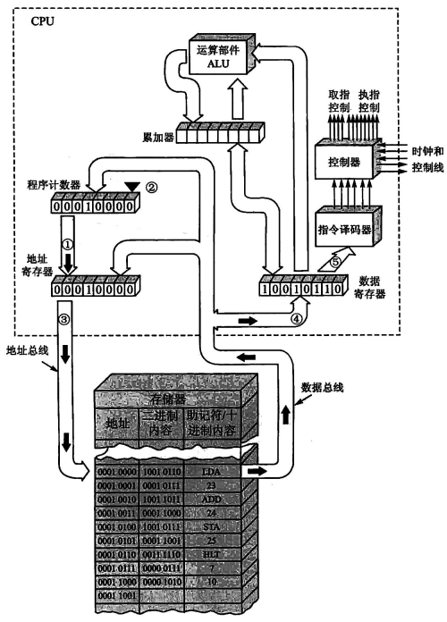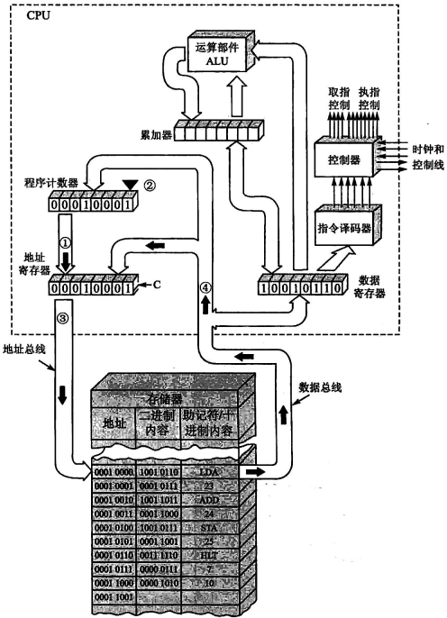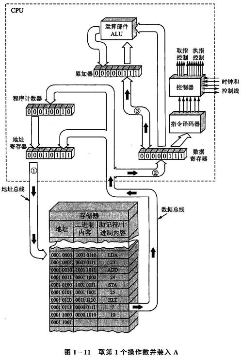 

 
 

## 1.3 常用数制和编码 
> **1.数制及数制转换** 
> 略.
 

> **2.计算机中常用编码** 
> <u>BCD码:</u>也就是用二进制来表示十进制; 
> <u>ASCII码:</u>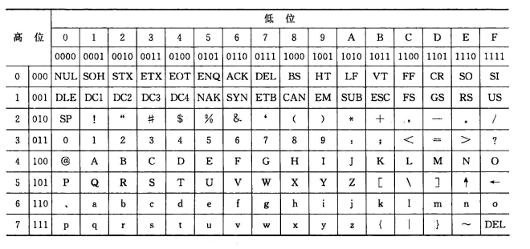

 
 

## 1.4 数据在计算机中的表示 
> **1.有符号数:** 
> 比如一个8位二进制数, 
> 最高位为符号位, 0表示+, 1表示-; 
>
> **二进制数表达形式（以有符号数为例）** 
> <u>原码:</u>最高位用01来表示正负; -127~+127 
> <u>反码:</u>正数原码反码相同; 负数反码在原码基础上, 符号位不变, 其余取反; -127~+127 
> <u>补码:</u>正数相同, 负数反码+1; -128~+127 
> <u>PS:</u> 注意溢出, 也就是计算时超出范围, 使得符号位被改变; 
>
> **机器数与真值:** 
> <u>机器数:</u> 机器中用二进制存在的数; 
> <u>真值:</u> 机器数所代表的值;  
> 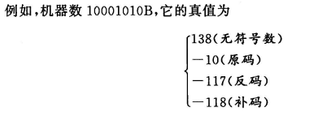

 

> **2.无符号数:** 
> 略

 
 

## 1.5 89C51/S51单片机
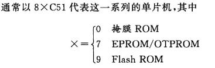

> **1.AT89C51/S51系列单片机** 
> 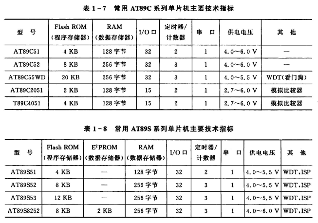 

> **2.STC89系列单片机** 
> 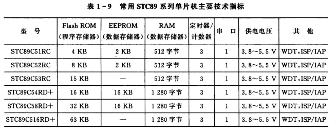 

> **3.SST89系列单片机** 
> 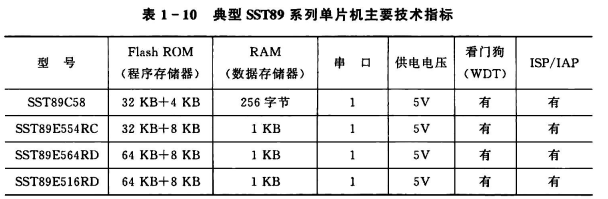 

