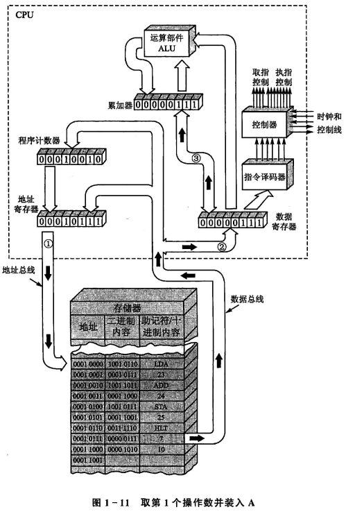
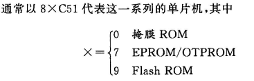
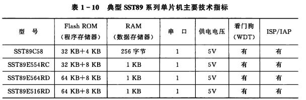

<!--
 * @Author: Connor2Chen 397080067@qq.com
 * @Date: 2024-10-09 16:33:41
 * @LastEditors: Connor2Chen 397080067@qq.com
 * @LastEditTime: 2024-10-11 13:59:12
 * @FilePath: \Learning-Note\05_CSLG\02_微机原理\单片机与接口技术知识点梳理.md
 * @Description: 
 * 
 * Copyright (c) 2024 by ${git_name_email}, All Rights Reserved. 
-->
 

---

[TOC]

---

# 第一章 微机基础知识
## 1.1 微处理器、微机和单片机概念
> **微处理器:** 微处理器一般表现为芯片，它本身不算是计算机，负责微型计算器处理、控制部分;
> 它由控制器、运算器、和多个寄存器组成; 
> **微机:** 属于计算机，除了有微处理器作为CPU外，还有存储器、接口适配器、IO设备等; 
> **单片机:** 属于微机+定时器电路等的组合; 
>

 

> **微处理器(机)的组成:**
> 
>  
> **1.运算器:** 
> <u>组成:</u> 运算器主要由算数逻辑单元(ALU)、累加器、寄存器等部分组成; 
> <u>作用:</u> 顾名思义,把传输到微处理器的数据进行算术或者逻辑运算; 
> <u>ALU主要输入来源:</u> 累加器、数据寄存器; 
> ALU进行不同运算操作是由不同控制线上信号决定的; 
> <u>操作数:</u> 对于8位单片机,ALU接收到来自累加器、数据寄存器的两份8位二进制数,因为要对这些数据进行操作，故称为操作数; 
> 
>  
> 
> **2.控制器:** 
> <u>组成:</u> 由程序计数器、指令寄存器、指令译码器、时序发生器和操作控制器等组成; 
> <u>作用:</u> 主要用于协调调度,主要如 1.从内存里取出一条指令,并且指出下一条指令在内存中的位置; 2.对指令进行译码或者测试,产生相应的操作控制信号; 3.指挥并控制CPU、内存和输入/输出设备之间数据流动的方向; 
>  
>  
> **3.CPU中的主要寄存器:**  
> <u>a.累加器(A):</u> 作用有点类似一个缓存,计算前提供操作数,计算后保存计算结果; 
> <u>b.数据寄存器(DR):</u>  可以通过数据总线,来对存储器或者输入输出设备进行数据暂存的单元;比如保存一条正在译码的指令,或者是送往存储器的数据字节; 
> <u>c.指令寄存器(IR)与指令译码器(ID): </u>  IR用来保存当前正在执行的指令,当一条指令执行的时候,流程是这样 (内存->数据寄存器->指令寄存器) ; 指令分为操作码字段 和 地址码字段, 都是二进制的 ; ID 主要是用于"翻译操作码字段",以便告诉机器需要进行什么操作; 
> <u>d.程序计数器(PC):</u> 单片机需要根据程序地址执行程序,这时候PC寄存器作用就显现出来 , 比如执行完第一条程序,这时候PC寄存器会指向第二条程序的地址, 这样机器就知道下一步执行什么程序 ; 并且由于一般程序是按顺序进行，所以很多时候都是+1; 
> <u>e.地址寄存器(AR):</u> 这个寄存器主要作用就是用来保持当前通信设备地址,可以是内部的存储单元,也可以是外部的IO设备; 

 
 

> **存储器和输入输出接口:** 
> **1.存储器:** 
>  
> 这是一个256x8位存储器,  
> 其中利用8位地址总线确定需要对哪个单元进行操作, 
> 并且可以利用控制信号来控制读写, 
> 数据通过8位数据总线来进行传递; 
>  
>  
> **2.I/O接口及外设:** 
> IO口对应的外设也有个固定地址, 也就是设备地址;

 
 

## 1.2 微机的工作过程
> **直接寻址:**  
> 类似下列的寻址方式,在操作码后跟上操作数的地址;

    LDA 23

 

> **1.执行指令顺序:** 
> 取指 -> 译指 -> 执指 , 反复执行; 
>  
> **2.执行指令过程:** 
>  
> 这是直接寻址方式, 这里占了三个机器周期, 
> 第一个就是取指令然后译指令码; 
> 第二个是在知道指令为LDA后, 把操作数地址给到译地址码处; 
> 第三个是知道地址后, 取出操作数执行操作; 
>  
> **3.执行一个程序的过程:** 
> 这里用LDA 23来做演示, 其中存储单元23中操作数为7; 
>  

 
 

## 1.3 常用数制和编码 
> **1.数制及数制转换** 
> 略.
 

> **2.计算机中常用编码** 
> <u>BCD码:</u>也就是用二进制来表示十进制; 
> <u>ASCII码:</u>

 
 

## 1.4 数据在计算机中的表示 
> **1.有符号数:** 
> 比如一个8位二进制数, 
> 最高位为符号位, 0表示+, 1表示-; 
>
> **二进制数表达形式（以有符号数为例）** 
> <u>原码:</u>最高位用01来表示正负; -127~+127 
> <u>反码:</u>正数原码反码相同; 负数反码在原码基础上, 符号位不变, 其余取反; -127~+127 
> <u>补码:</u>正数相同, 负数反码+1; -128~+127 
> <u>PS:</u> 注意溢出, 也就是计算时超出范围, 使得符号位被改变; 
>
> **机器数与真值:** 
> <u>机器数:</u> 机器中用二进制存在的数; 
> <u>真值:</u> 机器数所代表的值;  
> 

 

> **2.无符号数:** 
> 略

 
 

## 1.5 89C51/S51单片机

> **1.AT89C51/S51系列单片机** 
>  

> **2.STC89系列单片机** 
>  

> **3.SST89系列单片机** 
>  

 
 

---

 
 

# 第二章 89C51/S51单片机的硬件结构与原理
## 2.1 单片机的内部结构和特点
> **1.单片机的基本组成** 
>  
> <u>组成</u>: 
> .8位80C51微处理器(CPU) 
> .RAM存储器 
> .ROM存储器 
> .4个IO口 
> .定时器 
> .内部中断 与 外部中断 
> .串口 
> .时钟 
>  
> <u>低功耗(省电)方式:</u> 
> .空闲方式:仅仅让CPU停止工作, 其它保持不变, 一般只需要正常的15%的电流; 
> .掉电方式:让振荡器停止工作, 也就是冻结时钟, 这时候只有RAM保存东西, 需要硬件复位恢复,这种方式功耗最低; 

> **2.单片机芯片内部结构** 
>  
> **中央处理单元:** 
> <u>运算器:</u> 有一个可以算术、逻辑运算的单元ALU, 两个暂存器TMP1/TMP2, 累加器ACC, 寄存器B, 程序状态寄存器PSW (上述为8位); 
> 
> .ALU(逻辑运算单元): 对半字节、一字节、二字节进行处理; 
> .ACC(累加器): 可以做运算,有时也暂存数据; 
> .PSW(程序状态字寄存器): 返回当前指令执行后的状态信息, 也可以认为是一个标志寄存器; 
> .B(8位寄存器): 在乘除运算的时候, 用来存放部分结果, 也可以作通用寄存器; 
> .布尔处理器: 以PSW的CY位,也就是进位为累加器; 
>
>  
>  
> 
> <u>控制器:</u>包括程序计数器PC、指令寄存器IR、指令译码器ID、振荡器和定时电路;
>
> .PC(程序计数器): 由PCH与PCL构成,都是8位，合起来16位; PC寄存器中的内容也就是指令的地址, 修改这个寄存器可以实现运行别的指令; 
> .IR/ID(指令寄存器/指令译码器): 用来存指令,"翻译"指令; 
>
>  
> 
> **存储器:**  
> <u>程序存储器(Flash ROM):</u> 用来存放程序 或者 表格常数; 
> <u>数据存储器(RAM):</u> 用来暂存数据,有128个字节,其中32字节工作寄存器,21字节特殊功能寄存器(SFR);
>
>  
>  
>
> **I/O接口:** 
> 略

 
 

## 2.2 单片机引脚及其功能
> PS:一个TTL大概为0.4mA;

> **1.电源引脚VCC与VSS** 
> .<u>VCC:</u> +5V供电; 
>
> .<U>vss:</u> 接地; 
>

> **2.外部晶振XTAL1与XTAL2** 
> .<u>XTAL1:</u> 接外部时钟; 
>
> .<u>XTAL2:</u> 接外部时钟时, 该引脚悬空, 也可以观察该引脚是否产生振荡来确定片内时钟是否工作; 
> 

> **3.控制信号引脚** 
> .<u>RST:</u> 硬件复位, 高电平保持2个机器周期(24个时钟振荡周期后), 复位(PC计数器从0X00开始运行);  
>
> .<u>#PSEN:</u> 程序存储允许输出信号端,  
> 读取外部ROM的时候, 每周期有两次脉冲, 
> 读取内部ROM的时候, 不动, 
> 一般与外部存储器的OE脚相连; 
> 带载能力为8个LS型TTL;  
> 
> .<u>ALE:</u> 正常上电工作后, 向外输出 $\frac{f_{osc}}{6}$的正脉冲信号, 可以用来检测芯片是否有问题; 
除此之外访问片外存储设备时, ALE输出信号可以控制锁存低8位的地址,比如ALE=1时,我们把地址总线上的数据改成0x30, 再让ALE=0,此时就可以锁存住这个0x30的地址，便于后续读写操作; 
PS: ALE端负载驱动能力为8个LS型的TTL;  
>
> .<u>#PROG:</u> 这里用#来表示低位有效, 带有4KB Flash ROM编程写入固化程序时, 可以作为编程脉冲输入端;
>   
>
> .<u>#EA:</u> 外部程序存储器地址允许输入端, 高电平时只访问片内Flash ROM, 但是当PC也就是程序计数器超过0FFFH溢出时, 会自动转到片外的程序地址;低电平只访问片外;  
>

> **4.IO口** 
> .<u>P0端口:</u>  
> 开漏输出, 准双向, 带载8个LS型TTL,  
> 作为输入时, 需要把端口锁存器(80H)全写1, 
> 在访问片外存储器的时候, P0口分时提供低8位地址 和 8位数据复用总线;
> 
>  
>  
>
> .<u>P1端口:</u> 
> 内部上拉, 双向, 带载4个TTL, 
> 
>  
>  
>
> .<u>P2端口:</u> 
> 内部上拉, 双向, 带载4个TTL, 
> 访问外部程序存储器 和 16位地址外部数据存储器的时候 提供高8位地址, 
> 
>  
>  
>
> .<u>P3端口:</u> 
> 内部上拉, 双向, 带载4个TTL, 
> 

 
 
 

## 2.3 单片机存储器配置
> .<u>普林斯顿结构:</u> 也就是把数据和程序都放在一个存储器中, 比如都在某个地址为0x30的设备中, 这时候需要调用程序或者数据都依靠访问 0x30这个地址来进行; 
>  
>
> .<u>哈佛结构:</u> 而C51采用哈佛结构, 也就是把程序和数据存储器分开. 比如C51中就可以分为4类，分别为 片内/外程序存储器、片内/外数据存储器; 
>  
> .<u>89C51存储空间分为三类:</u> 
> 片内外程序存储(16位地址); 
> 片外数据存储(16位地址); 
> 片内数据存储(8位地址), 其中0x80~0xFF为固定的特殊寄存器; 
> 对于这三类也有不同的三种指令集： 
> 对于ROM直接用 MOVC  
> 对于片外RAM使用 MOVX  
> 对于片内RAM使用 MOV  
> 除此之外, 访问片外ROM的话, 像下图, 需要#PSEN有效; 
>  

> **1.程序存储器地址空间** 
> .<u>分类:</u> 
> MASK ROM(掩膜ROM): 在生产的时候程序烧进去就不可以改了, 适合大规模生产完善的产品用; 
>
> OTPROM(一次性可编程ROM) 
>
> EPROM(可擦除ROM): 可以擦除, 但是要用紫外线, 比较麻烦; 
>
> E2PROM(电可擦除ROM): 刷写速度稍微慢点; 
>
> Flash ROM(快闪): 电可擦除, 刷写速度快; 
>  
> 89C51最大外接ROM为64KB, 
> 当外接时需要注意#EA, 接地时强制从外部读程序; 接高电平时先读片内的,溢出之后读片外的;
>   
>  
>  
> 
> .<u>AT89S51单片机程序存储器使用:</u> 
>  AT89S51自带4KB的Flash ROM; 
> 
> .固定的中断地址 
>  
>  
>  
>  
>  
> .<u>AT89S52单片机程序存储器使用</u>: 
> .AT89S52自带8KB的Flash ROM; 
> 
> .固定的中断地址 
>  
>  

> **2.数据存储器地址空间**
> 
