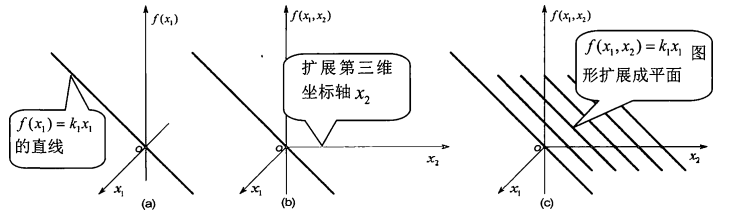

<!--
 * @Author: Connor2Chen 397080067@qq.com
 * @Date: 2024-09-10 15:09:41
 * @LastEditors: Connor2Chen 397080067@qq.com
 * @LastEditTime: 2024-09-13 15:38:55
 * @FilePath: \Learning-Note\06_Robot\01_线性代数的几何意义\线代代数的几何意义学习笔记.md
 * @Description: 
 * 
 * Copyright (c) 2024 by ${git_name_email}, All Rights Reserved. 
-->

---

[TOC]

---

---

# 1.什么是线性代数
## 1.1 “代数”的意义
> **代数：** 用字母符号来研究一些抽象问题；

## 1.2 “线性”的意义
> **线性：** 线性空间里的线性变换；
### 1.2.1 线性函数
> 线性函数要满足两个特性，也就是**可加性**和**齐次性**； 
> **可加性：** 简单来说就是 $f(a+b)=f(a)+f(b)$； 
> **齐次性：**  简单来说就是 $f(ka)=kf(a)$； 
> **线性：** 所以说线性是一个可以缩放和叠加的概念；

### 1.2.2 线性函数概念推广
> **线性齐次函数拓展系数矩阵：** 
> 首先我们有一个n元线性函数组 $y=k_1x_1+k_2x_2+...+k_nx_n$ 
> 我们把它提取出来变成两个竖着的数组，分别为： 
> 1.${x_1,x_2,...,x_n}$； 
> 2.${y_1,y_2,...,y_m}$； 
> 3.此时系数则为：； 
>  
>  
> 这里我们也可以称这个系数矩阵为$K$；

### 1.2.3 多元线性函数的几何意义
> **二维拓展到三维：** 
> 什么是二维？抽象说就是在笛卡尔二维坐标系里，可以表现为一个直线， 
> 如$f(x)=kx$,这就是一个过原点，斜率为k的直线； 
> 
> 
>
> 那么我们将其拓展到三维，可以试着表示为$f(x_1,x_2)=k_1x_1$, 
> 易看出，这是一个由$y=k_1x_1$向$x_2$拉过去扩展的一个平面， 
> 并且其过$x_2$轴，因为对于$f(x_1,x_2)=k_1x_1$来说，$x_2$取值可以任意； 
> 

> **两个平面加起来：** 
> emmm,也就是$f(x_1,x_2)=k_1x_1+k_2x_2$,因为符合可加性，所以认为是这个两个平面"加起来"的结果，从笛卡尔三维坐标系里也可以认为是符合这个函数所有点组成的一个平面； 
>
> **超平面：** 
> 这是一个新的概念，比如对于三维中，我们称一个常说的平面为平面，或者超平面；对于平面来说，我们称线为超平面； 
> 也就是说，**对于$R^{n+1}$维的空间来说，我们称低一维度的$R^{n}$维空间几何图形为"平面"或者"超平面"**; 

> **PS：** 
> 1.线性函数形式： 
> $f(x_1,x_2,...,x_n)=k_1x_1+k_2x_2+...+k_nx_n$; 
> $k_1x_1+k_2x_2+...+k_nx_n-f(x_1,x_2,...,x_n)=0$; 
> $k_1x_1+k_2x_2+...+k_nx_n=c$; 
>  
> 2.不过原点的超平面可称之为空间，但是不能称之为线性空间；

## 1.3 线性映射和线性变化的几何意义
### 1.3.1 线性映射的几何意义
> 映射是把线段映射到线段，或者说向量映射到向量; 
> 线性算子其实也可以看作映射; 
>  
> 线性映射的几何意义中提到，$T$，即映射也可以认为是一种运算法则，除此之外， 
> 像在$T(a)=ka$之中，这里的a不单单可以指代一个坐标点，一段向量，一个图形，我认为映射也算是一种关系； 
>

### 1.3.2 线性变化的几何意义
> 1.线性变化是线性映射的一种形式，映射通常是指向另一个空间，而变换是指向本身; 
> 2.首先'为线性变化$T$的一种简单写法; 
>
> 线性变化的两个含义： 
> 1.变化空间里的向量，空间坐标系不变; 
> 2.变化空间坐标系，向量不变; 

## 1.4 线性代数故事
    NC

## 1.5 线性代数作用
    NC
---

 
 
 

---
# 2.向量的基本几何意义
## 2.1 向量的几何意义
### 2.1.1 自由向量的概念
> 向量既有大小，又有方向; 
> 在物理学中，向量称为矢量; 
>  
> **自由向量:** 运行在一条直线上随便平移的向量;
> **向量相等:** 大小相等，方向相同;

### 2.2.2 向量的代数表示
> 几何表示为 $\vec{AB} $; 
> 代数表示为 $\vec{a} $; 
> 有序数列表示为 (xi,yj,zk); 

> **向量运算法则:**  
> 加减乘，其中乘法包括点乘和叉乘; 

## 2.2 向量加法的几何与物理意义
> 关于几何与物理意义求证略; 
> 遵循平行四边形法则,或者用三角形法则; 
>  
> 减法可以视为加法的逆运算; 

## 2.3 向量内积的几何与物理意义
### 2.3.1 向量内积的几何解释
> **几何解释:** 向量内积的话，可以视作一个向量在另一个向量上投影的积; 
> **计算:**  
> $\vec{a}・\vec{b}=abcosθ$; 
> $\vec{a}・\vec{b}=a_xb_x+a_yb_y+a_zb_z$; 
> $a=\sqrt{\vec{a}・\vec{a}}$; 
>
> **PS:** 如果想要将一个向量变换到新的坐标系，那么只要对新坐标系轴向量进行内积运算即可。这个结论很重要，这是傅立叶分析的理论基础之一。
>

### 2.3.2 向量内积的物理解释
> **以拉动滑块举例:**  
> 
>  设做功为W,则： 
> (a)$W=\vec{F_x}・\vec{S_x}+\vec{F_y}・\vec{S_y}$; 
> (b)$W=\vec{F_s}・\vec{S}=\vec{F}・\vec{S}・cosθ$; 
>
> **PS:** 关于用向量内积求证余弦差公式; 
>  
>  

## 2.4 向量叉积的几何意义与物理意义
### 2.4.1 叉积的定义与几何解释
> **计算公式:**  
> 假设 $\vec{a}=(a_x,a_y,a_z)$,$\vec{b}=(b_x,b_y,b_z)$
> 那么  
> 1.$\vec{a}$x$\vec{b}$=($absinθ$)$\vec{n_o}$,其中$\vec{n_o}$是垂直于$\vec{a}$、$\vec{b}$扩展成平面的法向量;  
> 2.$\vec{a}$x$\vec{b}=(a_yb_z-a_zb_y,a_zb_x-a_xb_z,a_xb_y-a_yb_x)$; 
> 3.$-\vec{a}$x$\vec{b}$ $= \vec{b}$x$\vec{a}$
>

> **右手定则:** 
>  
> 食指指向a,中指正交指向b，大拇指正交指向法向量位置;

### 2.4.2 叉积的物理意义
> **物理称谓:** 叉积向量在物理中称为轴向量; 
>
> **例子:** 比如螺丝的力矩问题,在物理中扭力向量和矢径向量的叉乘为螺丝的力矩，这反映到实际应用就是螺丝进出; 
>  

## 2.5 向量混合运算的几何意义
### 2.5.1 向量加法结合律
> **向量加法结合律:** $(\vec{a}+\vec{b})+\vec{c}=\vec{a}+(\vec{b}+\vec{c})$; 
 
### 2.5.2 向量数乘分配律
> **向量数乘分配律:** $k(\vec{a}+\vec{b})=k\vec{a}+k\vec{b}$; 
 
### 2.5.3 向量点乘分配律
> **向量点乘分配律:** $\vec{a}・(\vec{b}+\vec{c})=\vec{a}・\vec{b}+\vec{a}・\vec{b}$; 
> 
### 2.5.4 向量叉乘分配律
> **向量叉乘分配律:** $(\vec{a}+\vec{b})*\vec{c}=\vec{a}*\vec{c}+\vec{b}*\vec{c}$; 
>  
> **线向量与面向量:**  
> 线向量:一个有向线段可以表示向量的几何图形,几何图形的方向为线段方向，几何图形面积为线段长度; 
> 面向量:所以一个有方向的图形也可以用向量来表示;
>

### 2.5.5 向量混合积
> 三重数积:比如$(\vec{a}・\vec{b})*\vec{c}$,之中，括号内结果是一个数值k，那么后续k*$\vec{c}$只是对$\vec{c}$的一个延展，这种称为三重数积;  
> 三重矢积:比如$(\vec{a}*\vec{b})*\vec{c}$,之中，括号内先是给出一个向量结果，再把向量与向量进行计算（不论叉乘还是点乘），这种称为三重矢积; 
>

    这部分先略过;

## 2.6 向量积和张量直接的关系
### 2.6.1 二维向量的内积、外积与张量
> 这部分我们从$\vec{a}=(a_xi,a_yj)$,$\vec{b}=(b_xi,b_yj)$开始讨论, 
> 在对于$\vec{a}\vec{b}$中,把它变成多项式，也就是$$\vec{a}\vec{b}=a_xb_xii+a_yb_yjj+a_xb_yij+a_yb_xji$$
> 对 **ii、jj、ij、ji**进行讨论的话，会发现 
> ii=jj=1，ij=ji=0的时候,$$\vec{a}\vec{b}=\vec{a}・\vec{b}$$
 
> ii=jj=0,ij=-ji=k的时候,则为$\vec{a}$x$\vec{b}$
>  
>  
> 还有ii=jj=0,ij=1,ji=-1;以及i=1,j=$\sqrt{-1}$的情况，这里不过多讨论;
>
> **结论:** 
> 不难发现 $\vec{a}\vec{b}=a_xb_xii+a_yb_yjj+a_xb_yij+a_yb_xji$ 这个式子中，前部分代表点乘特性,后部分表现叉乘特性 
> 所以认为 $\vec{a}\vec{b}=\vec{a}・\vec{b}+\vec{a}*\vec{b}$
> 上面这种多项式展开叫做**直积**,其结果叫做**张量**

### 2.6.2 三维向量的内积、外积与张量
    与上述类似

 

## 2.7 向量除法的几何意义
> **二重向量叉积公式：** $\vec{a}*(\vec{b}*\vec{c})=\vec{b}(\vec{a}・\vec{c})-\vec{c}(\vec{a}・\vec{b})$ 
> **除法的不确定性:** 
>  
> 这里可以看出来,根据点乘与叉乘的数学公式，会发现a对应很多b得到的结果都一样，那么可能造成除法没有意义;
>  
> 但是当同时知道了点乘和叉乘的结果之后，可以让除法变得有意义;

## 2.8 变向量的几何意义
### 2.8.1 二维变向量的几何图形
> 假设变向量为$\vec{a}=(x_1,x_2)$,那么它可以表示一整个平面上任意一个向量; 
> 如果固定一个变量,则表示为指向一条直线的向量,
>  
### 2.8.2 三维变向量的几何图形
#### 太难懂

### 2.8.3 变向量的应用
    NC

## 2.9 复向量的几何意义
### 2.9.1 向量与复数的关系
> 1.假如把复数$z_3$看作向量,那么是$z_1与z_2$的张量积,也就是:$$z_3=z_1・z_2+z_1*z_2$$
>  
> 2.向量没有一般意义的除法，但是复数有除法;  
> 3.向量伸缩与旋转是一种经典的线性变换在几何上的表现,复数也可以进行伸缩与旋转,如: 
> $z_1=r_1e^{iθ_1}$,$z_2=r_2e^{iθ_2}$,那么:$$z_3=z_1z_2=(r_1r_2)e^{i(θ_1+θ_2)}$$
> 这里伸缩为$r_1或r_2$,旋转了θ=arg$z_1$或arg$z_2$,

### 2.9.2 复向量的几何意义
> 向量的复数形式与复数的向量形式二者等价, 
> 
 
 
 

## 2.10 向量和微积分的关系
### 2.10.1 微分的几何意义
>  
> 这里假设$f(x)$的斜率为k，那么dy=kΔx,由此易知: 
> 当Δx一直变小，接近到0的时候，N点往M方向下滑，一直接近; 
> 最后可以形成Δy=dy的情况; 
> 上述方式可以从曲线转换成直线,也就是弧线MN会接近MP;

### 2.10.2 微元即为向量

 
 
 

---

# 3.行列式的几何意义
## 3.1 行列式的定义
 
 
 

    未完

