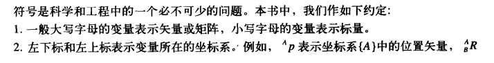
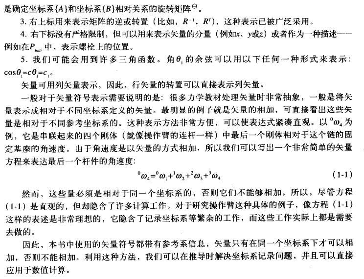
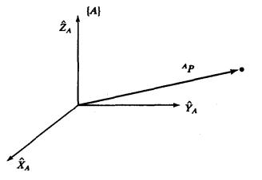

<!--
 * @Author: Connor2Chen 397080067@qq.com
 * @Date: 2024-09-13 15:39:57
 * @LastEditors: Connor2Chen 397080067@qq.com
 * @LastEditTime: 2024-10-09 14:09:11
 * @FilePath: \Learning-Note\06_Robot\02_机器人学导论\机器人学导论.md
 * @Description: 
 * 
 * Copyright (c) 2024 by ${git_name_email}, All Rights Reserved. 
-->

---

[TOC]

---

# 第一章 绪论
## 1.1 背景
    NC
## 1.2 操作臂的机构与控制
> **术语介绍:** 
> **1.位姿:** 即位置和姿态，在一个空间坐标系中来表示; 
> **2.操作臂正运动学:**  
> 输入关节参数,输出末端位置;
> 
>  
> a.运动学中，研究物体运动不考虑引起这个运动的力; 
> b.运动学中，研究位置、速度、加速度、位置变量对于时间或其它变量的高阶微分; 
> c.将操作臂的连杆视为刚体,关节用于测量相邻连杆的相对位置 ―――― 转动关节，这个相对位置称为关节角 ; 滑动关节,这个相对位置称为关节偏距; 
> 
> **3.自由度:** 独立位置变量的数目; 
> **4.逆运动学:** 给定位姿参数,逆推关节参数; 
> **5.速度、静力、奇异性:** 静力主要是研究机体平衡问题; 
> **6.动力学:** 主要研究产生运动的力; 
> **7.轨迹生成:**   
> 比如研究A点到B点时,各个关节,连杆轨迹; 
> **8.线性位置控制:** 用于补偿; 
> **9.非线性位置控制**  

## 1.3 符号
 
 

## 第一章的自我思考部分
### 简述运动学、工作空间、轨迹定义
> **运动学:** 我认为的运动学主要就是**研究产生运动的力**,比如使滑轮上拉重物,
> 我们研究这个上拉的力如何产生. 
> **工作空间:** 也就是我们研究机体所能达到所有点的一个集合,一般可以用三维坐标系来表示。 
> **轨迹:** 这个毕竟好理解,可以简单理解为研究运动路径过程; 
### 简述坐标系、自由度、位置控制定义
> **坐标系:** 主要就是需要一个参考系,坐标系根据研究对象维度不同通常也可以分为一二三维等; 
> **自由度:** 简单来说就是可以控制参数的个数,或者说是电机个数; 
> **位置控制:** 让机体或者末端移动到指定位置,并且保持在该位置,需要一定精准度; 

 
 
 

---

 

# 第二章 空间描述与变换
## 2.2 描述:位姿与坐标系
### 位置的描述

> 如上图,我们用三个矢量表示出$A$这个坐标系, 
> 那么就可以在矢量P前置A,表示出P这个矢量在A坐标系中; 

