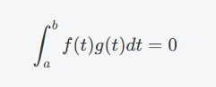
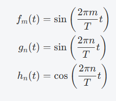
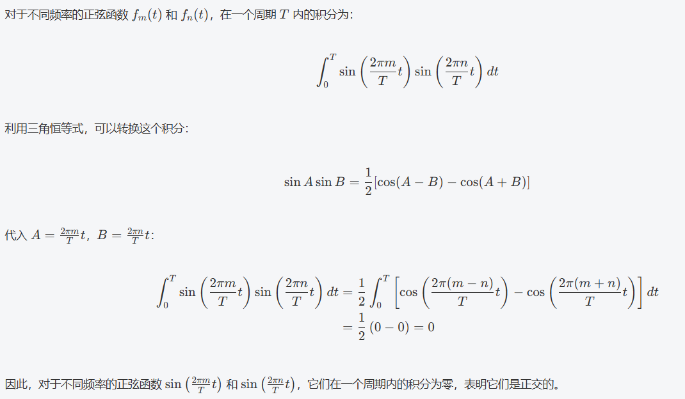
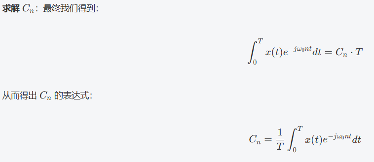

<!--
 * @Author: Connor2Chen 397080067@qq.com
 * @Date: 2024-09-10 20:21:04
 * @LastEditors: Connor2Chen 397080067@qq.com
 * @LastEditTime: 2024-10-12 11:26:46
 * @FilePath: \Learning-Note\07_HNND\01_数学\一些常见式子和定理.md
 * @Description: 
 * 
 * Copyright (c) 2024 by ${git_name_email}, All Rights Reserved. 
-->

---

[TOC]

---

---

# 1.常见函数
## 1.1 lnx
> **定义**
>$lnx$是以$e$为底的对数函数，也就是 $lnx$ = $ log_e{x}$ 
>  
>  
> **基本性质**
> ln(xy) = lnx + lny  
> ln($\frac{x}{y}$) = lnx - lny  
> $lnx^2$ = 2lnx ; $lnx^x$ = xlnx  
> $log_25$ = $\frac{lg5}{lg2}$ = $\frac{ln5}{ln2}$ 

## 1.2 复指数函数
> **一般形式**
>  $$e^{jθ}=cos(θ)+jsin(θ)$$
>  
> **基本性质** 
> .周期性: $e^{j(θ+2\pi n)}=e^{jθ}$ 
> .复平面中: 可以认为一个旋转向量,长度为1, 角度为θ; 
>  
>  
> **与三角函数的转换** 
> .欧拉公式: $$cos(θ)=\frac{e^{jθ}+e^{-jθ}}{2}$$    $$sin(θ)=\frac{e^{jθ}-e^{-jθ}}{2j}$$
> .欧拉公式反转: $$e^{jθ}=cos(θ)+jsin(θ)$$  $$e^{-jθ}=cos(-θ)+jsin(-θ)=cos(θ)-jsin(θ)$$

---

---
# 2.基本不等式
> $\frac{a+b}{2}≥\sqrt{ab}$;  
> $a+b≥2\sqrt{ab}$;  
>
---

---
# 3.函数正交与频率
> .**函数正交条件**： 两个函数在区间[a,b]中正交条件为，两个函数相乘，在区间[a,b]的积分为0; 
>  
>  
>  
> **正弦与余弦函数的正交** 
> .假设三个函数,有着频率与相位的差别; 
>  
>  
>  
> .不同频率时: 不同频率的sin函数会正交; 
>  
>  
> .不同频率的余弦函数也会正交,这里就不列出推导过程; 
> .不同频率的正余弦函数也正交,这里也不列出推导过程了,更需注重结论; 
>  
---

---
# 4.三角恒等式
> **基本恒等式**:  
> .平方恒等式: $$sin^2(θ)+cos^2(θ)=1$$ 
> .正切和余切: $$tanθ=\frac{sinθ}{cosθ}$$ $$cotθ=\frac{cosθ}{sinθ}$$ 
> .正割与余割: $$secθ=\frac{1}{cosθ}$$ $$cscθ=\frac{1}{sinθ}$$ 
>  
> **和差公式**: 
> .正弦和差公式: $$sin(a±b)=sin(a)cos(b)±cos(a)sin(b)$$ 
> .余弦和差公式: $$cos(a±b)=cos(a)cos(b)?sin(a)sin(b)$$ 
> .正切和差公式: $$tan(a±b)=\frac{tan(a)±tan(b)}{1?tan(a)tan(b)}$$ 
>  
>  
> **倍角公式**: 
> .正弦倍角公式: $$sin(2θ)=2sinθcosθ$$ 
> .余弦倍角公式: $$cos(2θ)=cos^2θ-sin^2θ=2cos^2θ-1=1-2sin^2θ$$ 
> .正切倍角公式: $$tan(2θ)=\frac{2tanθ}{1-tan^2θ}$$
>  
>  
>  
> **传递性恒等式**: 
> .和与差的正弦: $$sin(a)+sin(b)=2sin(\frac{a+b}{2})cos(\frac{a-b}{2})$$ 
> .和与差的余弦: $$cos(a)+cos(b)=2cos(\frac{a+b}{2})cos(\frac{a-b}{2})$$ 
>  
>  
> **其它恒等式**: 
> .正弦与余弦的关系: $$sin(\frac{\pi}{2}-θ)=cosθ$$  $$cos(\frac{\pi}{2}-θ)=sinθ$$
> .相似角的性质: $$sin(-θ)=-sinθ$$ $$cos(-θ)=cosθ$$ $$tan(-θ)=-tanθ$$
>
>  
>  
> 
> **其它包括变换**: 
> 
> $$sinAsinB=\frac{1}{2}[cos(A-B)-cos(A+B)]$$
---

# 方法论
## 3.1 信号转换为傅里叶级数展开
> **傅里叶级数基本形式**: $$x(t) = \sum_{n=-\infty}^{\infty} C_n e^{j\omega_0 n t}$$
> 其中, $C_n$为傅里叶系数 , $ω_0=\frac{2\pi}{T}$为基本角频率;
>  
>  
>  
> **关于傅里叶级数基本形式向Cn转换**: 
> .首先把信号$x(t)$乘上一个$e^{-jω_0nt}$, 并且在一个周期$T$内进行积分; 
> .由于正交特性,会使$x(t)$中从负无穷到正无穷的项中, 只有第n项不为0; 
> .最终求出$C_n$:
> 