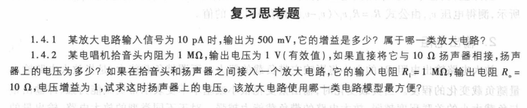
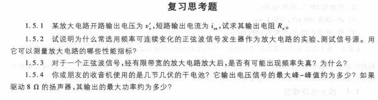
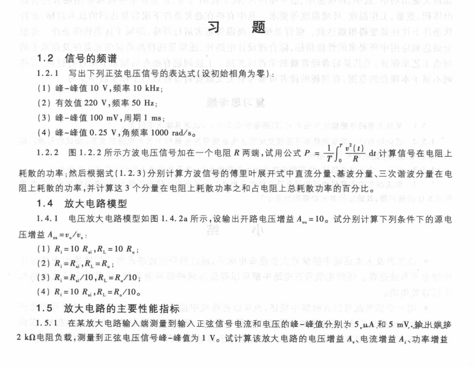
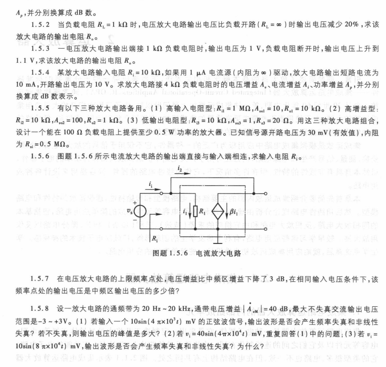
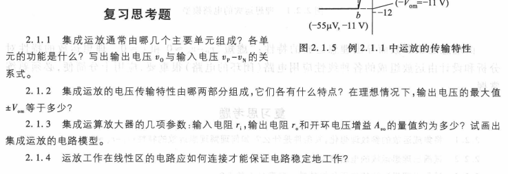
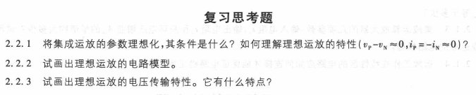
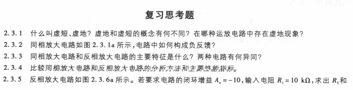
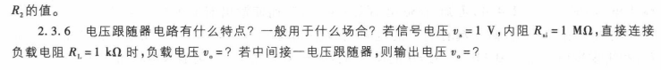

<!--
 * @Author: Connor2Chen 397080067@qq.com
 * @Date: 2024-10-12 14:47:37
 * @LastEditors: Connor2Chen 397080067@qq.com
 * @LastEditTime: 2024-10-15 10:25:56
 * @FilePath: \Learning-Note\07_HNND\02_电子技术基础\模电思考题.md
 * @Description: 
 * 
 * Copyright (c) 2024 by ${git_name_email}, All Rights Reserved. 
-->

---

[TOC]

---
# 第一章
## 1.4 放大电路模型部分 
 
>  
>  
>  
>  
>  
>  
>  
>  
>  
>  
>  
>  
>  
>  
>  
>  
>  
>  
>  
>  
>  
>  
>  
>  
>  
>  
>  
>  
>  

## 1.5 放大电路性能与指标 
 
>  
>  
>  
>  
>  
>  
>  
>  
>  
>  
>  
>  
>  
>  
>  
>  
>  
>  
>  
>  
>  
>  
>  
>  
>  
>  
>  
>  
>  

## 第一章 章末习题
 
 
>  
>  
>  
>  
>  
>  
>  
>  
>  
>  
>  
>  
>  
>  
>  
>  
>  
>  
>  
>  
>  
>  
>  
>  
>  
>  
>  
>  
>  
>  
>  
>  
>  
>  
>  
>  
>  
>  
>  
>  
>  
>  
>  
>  
>  
>  
>  
>  
>  
>  
>  
>  
>  
>  
>  
>  
>  
>  

# 第二章 运放部分习题
## 2.1 集成运放习题
 
>  
>  
>  
>  
>  
>  
>  
>  
>  
>  
>  
>  
>  
>  
>  
>  
>  
>  
>  
>  
>  
>  
>  
>  
>  
>  
>  
>  
>  

## 2.2 理想运放习题
 
>  
>  
>  
>  
>  
>  
>  
>  
>  
>  
>  
>  
>  
>  
>  
>  
>  
>  
>  
>  
>  
>  
>  
>  
>  
>  
>  
>  
>  

 
 

## 2.3线性运放习题
 
 
>  
>  
>  
>  
>  
>  
>  
>  
>  
>  
>  
>  
>  
>  
>  
>  
>  
>  
>  
>  
>  
>  
>  
>  
>  
>  
>  
>  
>  

