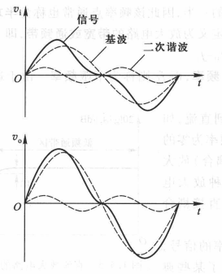

<!--
 * @Author: Connor2Chen 397080067@qq.com
 * @Date: 2024-10-11 15:51:26
 * @LastEditors: Connor2Chen 397080067@qq.com
 * @LastEditTime: 2024-10-15 10:25:10
 * @FilePath: \Learning-Note\07_HNND\02_电子技术基础\模电部分.md
 * @Description: 
 * 
 * Copyright (c) 2024 by ${git_name_email}, All Rights Reserved. 
-->

---

[TOC]

---

# 第一章 绪论

## 1.1 信号
> .**传感器**: 把非电信号转换为电信号的设备;
>  
>  
> .**戴维宁等效电路**: 把理想电压源和电阻串联; 
> 
> 
>  
>  
> .**诺顿等效电路**: 理想电流源和电阻并联; 
> 
> 
 
 

## 1.2 信号的频谱
> **频谱图** 
> .幅度频谱: 幅度随角频率变化; 
> .相位频谱: 相位随角频率变化; 
>  
>
>  
>

## 1.4 放大电路模型 
> **模拟信号的放大**: 
> .线性放大: 也就是放大电路 输出信号的信息 与 输入信号的信息 完全相同; 
>  
>  
> .放大电路电路图: 
>  
> 其中$v_s$为信号源、$R_{si}$为信号源内阻、$R_L$为负载电阻; 
>
>  
>  
>
> .放大电路分类: 
>  1.电压放大电路: 电压转电压 $v_o=A_vv_i$ 
>  2.电流放大电路: 电流转电流 $i_o=A_ii_i$ 
>  3.互阻放大电路: 电流转电压 $v_o=A_ri_i$ 
>  4.互导放大电路: 电压转电流 $i_o=A_gv_i$ 
> 这些放大电路都是工作在线性体条件下的,

> **放大电路模型**: 
> .等效电路模型: 
>  
> (a)关于电压放大电路适用于 信号源内阻小 负载电阻大: 
> 首先我们从$v_o=A_{vo}v_i\frac{R_L}{R_L+R_o}$看, 因为在串联电阻分压下, $v_o$也就是输出电压会和$A_{vo}v_i$有一定的差距。这时候我们使$R_L$尽量的大, 可以使$\frac{R_L}{R_L+R_o}$趋近于1,这是 负载电阻大 说法的来源; 
> 下面, 我们来看输入部分, $v_i$也就是$R_i$两端的电压, 这个电压由$v_s$分压得到, 具体为 $v_i=v_s\frac{R_i}{R_i+R_{si}}$;
> 
> (b)类似A的推导, 电流放大电路适用于 信号源内阻大 负载电阻小; 
>
> ps:上述模型之间可以根据等效定理变化; 
>
>  
>  
>  
>
> .隔离放大:为了提高安全性和抗干扰能力, 让输入输出之间不共地,没有公共点; 
>  

 
 

## 1.5 放大电路的性能和指标 
> **输入电阻** 
> .对于电压放大电路和互导放大电路来说: $R_i$越大, 则$v_i$越大; 
> .对于电流放大电路和互阻放大电路来说: $R_i$越小, 则$i_i$越大; 

> **输出电阻** 
> .电压放大电路 与 互阻放大电路: $R_o$越小, $R_L$的变化对输出电压$v_o$影响越小, 也就越好; 
> .电流放大电路 与 互导放大电路: $R_o$越大, $R_L$的变化对输出电流$i_o$影响越小; 

> **增益** 
> .分类:  
> 1.电压增益 $A_v$ 
> 2.电流增益 $A_i$ 
> 3.互阻增益 $A_r$ 
> 4.互导增益 $A_g$ 
>
>  
> 
> .对于$A_v$与$A_i$来说: 在工程上经常用以10为底的对数来表达增益, 单位为dB,  
> $电压增益=20lg|A_v| $ dB 
> $电流增益=20lg|A_i| $ dB 
> $功率增益=10lg|A_p| $ dB 
>
> PS:这里注意一点, 增益的负值, 我们可能看到一个-20dB的时候, 会想着 $\frac{vo}{vi}$为负数, 是否存在相位差, 其实不是的. -20dB表达的是 $\frac{v_o}{v_i}=\frac{1}{10}$;

> **频率响应** 
> .原因: 电路中存在着电抗元件等原因; 
>  
> .考虑电抗元件下的增益:  
>
>  
>  
> 
> .例子:  
> 从例子中可以看到, 在频率为 20Hz 与 20KHz 点的时候,增益下降了3dB,并且远离两点时, 增益持续下降; 
> 这里我们还可以知道, 根据$A_p=10lg|\frac{P_o}{P_i}|$可知, 这个-3dB也就是增益为$\frac{1}{2}$,这种情况可以把这个 20Hz 与 20KHz 的点称为半功率点. 高/低于半功率点的差定义为 **带宽 或 通频带(BW)** $$BW=f_H-f_L$$ 
> 然后$f_H$与$f_L$称为上下限频率, 又因为一般$f_L<<f_H$, 
> 所以$BW≈f_H$
>
>  
>  
>  
>  
>
> .直接耦合放大电路: 也就是直流放大电路 
>  
> 比如上述这种情况, 通频带下限频率直接到0Hz那里; 
>
>  
>  
>  
>  
>
> 线性失真: 
> 1.幅度失真: 由于通频带问题, 频率低的基波被很好的放大, 而频率较高的二次谐波反之, 从而导致信号波形的失真; 
>  
> 
> 2.相位失真: 由于放大后相移导致; 
>  
>
> 上述两种失真都是由于线性电抗元件导致的失真, 故称为**线性失真**;
>

>**非线性失真** 
> .非线性失真: 由于非线性特性引起的失真; 
>  
>  
>  
>
> .传输特性曲线: 用来描述放大电路输入输出特性的曲线; 

 
 
 

---
---

# 第二章 运算放大器
## 2.1 集成电路运算放大器
> **集成运放内部单元** 
> * 内部结构框图:  
>  
> 从结构上来看, 
> 1.输入级采用差分放大电路, 其对称性有助于提高电路性能; 
> 2.中间级为电压放大电路, 有一致多级电压放大, 用于提升电压增益$A_v$, 
> 3.输出级为功率放大电路, 其提供功率增益, 但是$A_v=1$; 
>  
> 然后在输入部分, 有P与N两种, 当$v_p输入(v_n=0)$时,$v_o$输出同相; 
> 当$v_n输入(v_p=0)$时, $v_o$为反相;  
> <u>或者</u>   
> 两端同时加入时, 
> 1.$v_{o1}=A_{v1}(v_P-v_N)$,此时我们得到$v_{o1}$; 
> 2.然后, $v_{o1}$到了中间级电压放大部分, 得到$v_{o2}=A_{v2}v_{o1}=A_{v_1}A_{v_2}(v_P-v_N)$; 
> 3.接下来的输出级作用不是放大电压, 而是提供功率, 所以这里的$A_{v3}=1$  
> 总得来说: 
> $v_o=A_{vo}(v_P-v_N)$, 这里的$A_{vo}=A{v_1}A_{v_2}A{v_3}$, 它也叫做运放的开环电压增益(开环增益也就是没用到反馈元件的增益);
>
>  
>  
> 
> * 符号: 
>  

> **运放的电路简化模型** 
> * 简化模型: 
>  
> 这部分其实介绍不多, 主要就是开环增益很大, 一般有$10^4$~$10^6$那样, $r_i$等效电阻大概有1MR;  
> $r_o$很小,一般100R以下; 

> **运放传输特性** 
> * 运放的电压传输特性曲线图: 
>  
>  
> 这个也很好理解, 因为开环电压增益很大,  
> 所以当$(v_P-v_N)$为正的时候, 电压会被放大很多倍; 那么负的时候反之; 
> 又因为最大不可能超过供电的电压吧 
> 所以就有了上述的特性图, 因为$A_{vo}$很大的缘故, 也就是斜率很大, 那条线几乎是垂直的.在其中就被称为线性区; 
>
>  
>  
> 
> * 例题2.1.1 
>  
> (1)  
> 这第一步非常好理解,说白了就是套公式进去; 
> (2)  
> 也就是套进去; 

 
 
 

## 2.2 理想运放
> **理想运放** 
> 
> * 模型图: 
>  
>
> * 说明: 
> 首先理想运放, 我们认为： 
> 1.$A_{vo}$趋近于无穷, 输入啥都给你干到满; 
> 2.$±V_{om}=V_±$, 也就是最大放大到供电电压; 
> 3.$r_i为∞$ , $r_o=0$ 
> 4.BW趋近于无穷, 也就是说通频带非常大, 没啥半功率点, 基本啥频率信号都给你拉满; 5.由$A_{vo}$趋近于无穷,可以推出来, ($v_P-v_N$)=$\frac{v_o}{A_{vo}}$,那么($v_P-v_N$)趋近于0,也可认为$v_P$与$v_N$之间虚短; 6.因为$r_i$趋近于∞,那么$i_1=\frac{(v_P-v_N)}{r_i}≈0$, 也可以认为是$i_P=-i_N=0$;
>  
>  总结下来就是: 理想运放输入两端点位接近相等, 电流几乎都为0, 增益无穷大, 但是最大只能拉到电源电压大小, 还有就是通频带无穷, 啥频率信号都拉满; 

 
 
 

## 2.3 基本线性运放
> **2.3.1 同相放大电路** 
> **1.基本电路** 
>  
> 这里本来应该$v_P=v_i$, $v_N=0$; 
> 但是依靠一个压分网络使得 $v_N=v_o\frac{R1}{R1+R2}$, 
> 从而导致$v_P-v_N$变低, 其中那个分压网络称为负反馈网络; 
>  
>  
> 
> 
> * 这里的推导: 
> $v_o=A_vv_i$, 这里的$v_i$也就是$v_P$, 根据虚短可知, 
> $v_P=v_N=\frac{R_1v_o}{R1+R_2}$,很好理解, 因为输出那里分压嘛, 
> 再代回去,有:$$v_o=A_v\frac{R_1v_o}{R_1+R_2}$$  
> 那么, $A_v=\frac{R_1+R_2}{R_1}$, 或者说是$A_v=1+\frac{R_2}{R_1}$ 
> 代回来就是:$$v_o=v_i(1+\frac{R_2}{R_1})$$
>
> **2.关于虚短的概念** 
> 同相放大电路中, 输入端两端电压接近相等, 相位相同是它在闭环工作下的重要特征; 
>
> **3.几项技术指标的计算** 
> * 闭环电压增益$A_v$ 
> 在上面有推导过程;
>
>  
>  
> 
> * 输入电阻$R_i$  
> 因为$v_i=v_P$（同相放大器）, 然后$v_P$与$v_N$之间那个$r_i$无穷, 所以$i_i$认为趋近0,
> 此时$R_i=\frac{v_i}{i_i}$, 认为趋近于无穷大; 
> 也就是输入端看进去认为电阻无穷大; 
>
>  
>  
>
> * 输出电阻: 趋近于0 
>
>  
>
> * 总结: 输入电阻无穷大, 输出电阻无穷小, 增益$A_v≥1$ 
>  
>  
> 
> **例题2.3.1**  
>  
>  
>  
>
>  
>  
>
> **4.电压跟随器** 
>  
> 对于上图做出一些改变, 令$R_1$趋近于无穷, $R_2$趋近于0, 则有: 
>  
> 这里可能会疑惑, 为什么多此一举,下面讲诉一下作用 
>  
> 比如像上图所示, 信号源的内阻非常大, 但是负载内阻又较小, 
> 此时之间接的话, 那大部分电压分在内阻那里, 负载分压很小, 
> 此时可以加上一个 电压跟随器, 输入端阻抗无穷大, 基本上电压都可以分到运放上面去,  
> 然后输出端阻抗无穷小, 然信号更好的到达负载上面; 
>
>  
>
> * **例题2.3.2** 
>  
>  

 

> **2.3.2 反相放大器** 
> **1.基本电路** 
>   
> **2.部分指标计算** 
> * (1)闭环电压增益: 
> 首先我们插入一个方法, 叫瞬时什么法判断负反馈, 说得很复杂, 但是说白了, 在有反馈的情况. 我们在输入端默认一个正或负的信号$V_i$, 看下输出端的输出$V_o$是正还是负. 然后再分压到输入部分. 看看是否对输入部分有抑制, 有的话为负反馈; 
> 比如这里, 我假定$v_i$给一个正电压信号, 因为作用在反相输入端, 则输出端为一个$v_o=-|A_v|v_i$, 再根据分压, 那么作用到$v_i$部分时, 会使原本的$v_i$变小, 大致认为上述为负反馈;  
> 下面, 我们来求$A_v$: 
> 首先, 因为负反馈, 所以有"虚短"这个情况, 那么$v_N≈v_P$, 
> 从(b)中可以看出, $i_1、i_2、i_i$, 其中i_i必然为0(因为虚短), 
> 那么 $i_1=i_2$(流经N节点的电流就那三个,其中i_i=0) 
> $$\frac{v_i-v_N}{R_1}=\frac{v_N-v_o}{R_2}$$
> 又因为"虚短",$v_N=v_P=0$($v_P接地$), 所以式子可以化简成: 
> $$\frac{v_i}{R_1}=\frac{-v_o}{R_2}$$
> $$A_v=\frac{v_o}{v_i}=-\frac{R_2}{R_1}$$ 
> 
>  
> 
> * (2)输入电阻$R_i$与输出电阻$R_o$ 
>  
> 输入电阻$R_i$: 这里从输入端口看进去 $$R_i=\frac{v_i}{i_1}=\frac{v_i}{\frac{v_i}{R_1}}=R_1$$
> 输出电阻$R_o$: 输出电阻也符合$r_o$趋近于0; 
> 根据教材中所说, $R_i$不能太大, 我认为是因为$A_v=-\frac{R_2}{R_1}$导致的, 假如把$R_i=R_1$取值过大的话, 会导致闭环电压增益很小; 
>
>  
>
> **例题 2.3.3**
>  
> * (1)很好理解, 利用电流电压关系; 
>  
>
> * (2)套数据就行了; 
>  
>  
> 
> * (3)套公式, 这里说的替换网络, 其实说白了就是弄成上面那种反相放大器的样子 ; 
>  
>
> * (4) ; 
>  
>  
>
>  
>  
>
> **例题2.3.4** 
>  
> * (1) 主要运用了基尔霍夫第二定律、虚短; 
>  
>
> * (2) 套公式; 
>  
> 

