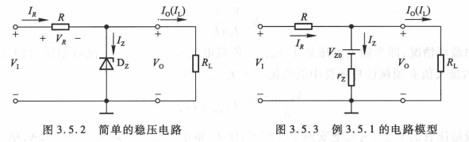
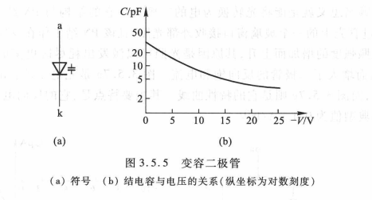

<!--
 * @Author: Connor2Chen 397080067@qq.com
 * @Date: 2024-10-11 15:51:26
 * @LastEditors: Connor2Chen 397080067@qq.com
 * @LastEditTime: 2024-10-18 16:46:05
 * @FilePath: \Learning-Note\07_HNND\02_电子技术基础\模电部分.md
 * @Description: 
 * 
 * Copyright (c) 2024 by ${git_name_email}, All Rights Reserved. 
-->

---

[TOC]

---

# 第一章 绪论

## 1.1 信号
> .**传感器**: 把非电信号转换为电信号的设备;
>  
>  
> .**戴维宁等效电路**: 把理想电压源和电阻串联; 
> 
> 
>  
>  
> .**诺顿等效电路**: 理想电流源和电阻并联; 
> 
> 
 
 

## 1.2 信号的频谱
> **频谱图** 
> .幅度频谱: 幅度随角频率变化; 
> .相位频谱: 相位随角频率变化; 
>  
>
>  
>

## 1.4 放大电路模型 
> **模拟信号的放大**: 
> .线性放大: 也就是放大电路 输出信号的信息 与 输入信号的信息 完全相同; 
>  
>  
> .放大电路电路图: 
>  
> 其中$v_s$为信号源、$R_{si}$为信号源内阻、$R_L$为负载电阻; 
>
>  
>  
>
> .放大电路分类: 
>  1.电压放大电路: 电压转电压 $v_o=A_vv_i$ 
>  2.电流放大电路: 电流转电流 $i_o=A_ii_i$ 
>  3.互阻放大电路: 电流转电压 $v_o=A_ri_i$ 
>  4.互导放大电路: 电压转电流 $i_o=A_gv_i$ 
> 这些放大电路都是工作在线性体条件下的,

> **放大电路模型**: 
> .等效电路模型: 
>  
> (a)关于电压放大电路适用于 信号源内阻小 负载电阻大: 
> 首先我们从$v_o=A_{vo}v_i\frac{R_L}{R_L+R_o}$看, 因为在串联电阻分压下, $v_o$也就是输出电压会和$A_{vo}v_i$有一定的差距。这时候我们使$R_L$尽量的大, 可以使$\frac{R_L}{R_L+R_o}$趋近于1,这是 负载电阻大 说法的来源; 
> 下面, 我们来看输入部分, $v_i$也就是$R_i$两端的电压, 这个电压由$v_s$分压得到, 具体为 $v_i=v_s\frac{R_i}{R_i+R_{si}}$;
> 
> (b)类似A的推导, 电流放大电路适用于 信号源内阻大 负载电阻小; 
>
> ps:上述模型之间可以根据等效定理变化; 
>
>  
>  
>  
>
> .隔离放大:为了提高安全性和抗干扰能力, 让输入输出之间不共地,没有公共点; 
>  

 
 

## 1.5 放大电路的性能和指标 
> **输入电阻** 
> .对于电压放大电路和互导放大电路来说: $R_i$越大, 则$v_i$越大; 
> .对于电流放大电路和互阻放大电路来说: $R_i$越小, 则$i_i$越大; 

> **输出电阻** 
> .电压放大电路 与 互阻放大电路: $R_o$越小, $R_L$的变化对输出电压$v_o$影响越小, 也就越好; 
> .电流放大电路 与 互导放大电路: $R_o$越大, $R_L$的变化对输出电流$i_o$影响越小; 

> **增益** 
> .分类:  
> 1.电压增益 $A_v$ 
> 2.电流增益 $A_i$ 
> 3.互阻增益 $A_r$ 
> 4.互导增益 $A_g$ 
>
>  
> 
> .对于$A_v$与$A_i$来说: 在工程上经常用以10为底的对数来表达增益, 单位为dB,  
> $电压增益=20lg|A_v| $ dB 
> $电流增益=20lg|A_i| $ dB 
> $功率增益=10lg|A_p| $ dB 
>
> PS:这里注意一点, 增益的负值, 我们可能看到一个-20dB的时候, 会想着 $\frac{vo}{vi}$为负数, 是否存在相位差, 其实不是的. -20dB表达的是 $\frac{v_o}{v_i}=\frac{1}{10}$;

> **频率响应** 
> .原因: 电路中存在着电抗元件等原因; 
>  
> .考虑电抗元件下的增益:  
>
>  
>  
> 
> .例子:  
> 从例子中可以看到, 在频率为 20Hz 与 20KHz 点的时候,增益下降了3dB,并且远离两点时, 增益持续下降; 
> 这里我们还可以知道, 根据$A_p=10lg|\frac{P_o}{P_i}|$可知, 这个-3dB也就是增益为$\frac{1}{2}$,这种情况可以把这个 20Hz 与 20KHz 的点称为半功率点. 高/低于半功率点的差定义为 **带宽 或 通频带(BW)** $$BW=f_H-f_L$$ 
> 然后$f_H$与$f_L$称为上下限频率, 又因为一般$f_L<<f_H$, 
> 所以$BW≈f_H$
>
>  
>  
>  
>  
>
> .直接耦合放大电路: 也就是直流放大电路 
>  
> 比如上述这种情况, 通频带下限频率直接到0Hz那里; 
>
>  
>  
>  
>  
>
> 线性失真: 
> 1.幅度失真: 由于通频带问题, 频率低的基波被很好的放大, 而频率较高的二次谐波反之, 从而导致信号波形的失真; 
>  
> 
> 2.相位失真: 由于放大后相移导致; 
>  
>
> 上述两种失真都是由于线性电抗元件导致的失真, 故称为**线性失真**;
>

>**非线性失真** 
> .非线性失真: 由于非线性特性引起的失真; 
>  
>  
>  
>
> .传输特性曲线: 用来描述放大电路输入输出特性的曲线; 

 
 
 

---
---

# 第二章 运算放大器
## 2.1 集成电路运算放大器(了解)
> **集成运放内部单元** 
> * 内部结构框图:  
>  
> 从结构上来看, 
> 1.输入级采用差分放大电路, 其对称性有助于提高电路性能; 
> 2.中间级为电压放大电路, 有一致多级电压放大, 用于提升电压增益$A_v$, 
> 3.输出级为功率放大电路, 其提供功率增益, 但是$A_v=1$; 
>  
> 然后在输入部分, 有P与N两种, 当$v_p输入(v_n=0)$时,$v_o$输出同相; 
> 当$v_n输入(v_p=0)$时, $v_o$为反相;  
> <u>或者</u>   
> 两端同时加入时, 
> 1.$v_{o1}=A_{v1}(v_P-v_N)$,此时我们得到$v_{o1}$; 
> 2.然后, $v_{o1}$到了中间级电压放大部分, 得到$v_{o2}=A_{v2}v_{o1}=A_{v_1}A_{v_2}(v_P-v_N)$; 
> 3.接下来的输出级作用不是放大电压, 而是提供功率, 所以这里的$A_{v3}=1$  
> 总得来说: 
> $v_o=A_{vo}(v_P-v_N)$, 这里的$A_{vo}=A{v_1}A_{v_2}A{v_3}$, 它也叫做运放的开环电压增益(开环增益也就是没用到反馈元件的增益);
>
>  
>  
> 
> * 符号: 
>  

> **运放的电路简化模型** 
> * 简化模型: 
>  
> 这部分其实介绍不多, 主要就是开环增益很大, 一般有$10^4$~$10^6$那样, $r_i$等效电阻大概有1MR;  
> $r_o$很小,一般100R以下; 

> **运放传输特性** 
> * 运放的电压传输特性曲线图: 
>  
>  
> 这个也很好理解, 因为开环电压增益很大,  
> 所以当$(v_P-v_N)$为正的时候, 电压会被放大很多倍; 那么负的时候反之; 
> 又因为最大不可能超过供电的电压吧 
> 所以就有了上述的特性图, 因为$A_{vo}$很大的缘故, 也就是斜率很大, 那条线几乎是垂直的.在其中就被称为线性区; 
>
>  
>  
> 
> * 例题2.1.1 
>  
> (1)  
> 这第一步非常好理解,说白了就是套公式进去; 
> (2)  
> 也就是套进去; 

 
 
 

## 2.2 理想运放(掌握)
> **理想运放** 
> 
> * 模型图: 
>  
>
> * 说明: 
> 首先理想运放, 我们认为： 
> 1.$A_{vo}$趋近于无穷, 输入啥都给你干到满; 
> 2.$±V_{om}=V_±$, 也就是最大放大到供电电压; 
> 3.$r_i为∞$ , $r_o=0$ 
> 4.BW趋近于无穷, 也就是说通频带非常大, 没啥半功率点, 基本啥频率信号都给你拉满; 5.由$A_{vo}$趋近于无穷,可以推出来, ($v_P-v_N$)=$\frac{v_o}{A_{vo}}$,那么($v_P-v_N$)趋近于0,也可认为$v_P$与$v_N$之间虚短; 6.因为$r_i$趋近于∞,那么$i_1=\frac{(v_P-v_N)}{r_i}≈0$, 也可以认为是$i_P=-i_N=0$;
>  
>  总结下来就是: 理想运放输入两端点位接近相等, 电流几乎都为0, 增益无穷大, 但是最大只能拉到电源电压大小, 还有就是通频带无穷, 啥频率信号都拉满; 

 
 
 

## 2.3 基本线性运放(掌握)
> **2.3.1 同相放大电路** 
> **1.基本电路** 
>  
> 这里本来应该$v_P=v_i$, $v_N=0$; 
> 但是依靠一个压分网络使得 $v_N=v_o\frac{R1}{R1+R2}$, 
> 从而导致$v_P-v_N$变低, 其中那个分压网络称为负反馈网络; 
>  
>  
> 
> 
> * 这里的推导: 
> $v_o=A_vv_i$, 这里的$v_i$也就是$v_P$, 根据虚短可知, 
> $v_P=v_N=\frac{R_1v_o}{R1+R_2}$,很好理解, 因为输出那里分压嘛, 
> 再代回去,有:$$v_o=A_v\frac{R_1v_o}{R_1+R_2}$$  
> 那么, $A_v=\frac{R_1+R_2}{R_1}$, 或者说是$A_v=1+\frac{R_2}{R_1}$ 
> 代回来就是:$$v_o=v_i(1+\frac{R_2}{R_1})$$
>
> **2.关于虚短的概念** 
> 同相放大电路中, 输入端两端电压接近相等, 相位相同是它在闭环工作下的重要特征; 
>
> **3.几项技术指标的计算** 
> * 闭环电压增益$A_v$ 
> 在上面有推导过程;
>
>  
>  
> 
> * 输入电阻$R_i$  
> 因为$v_i=v_P$（同相放大器）, 然后$v_P$与$v_N$之间那个$r_i$无穷, 所以$i_i$认为趋近0,
> 此时$R_i=\frac{v_i}{i_i}$, 认为趋近于无穷大; 
> 也就是输入端看进去认为电阻无穷大; 
>
>  
>  
>
> * 输出电阻: 趋近于0 
>
>  
>
> * 总结: 输入电阻无穷大, 输出电阻无穷小, 增益$A_v≥1$ 
>  
>  
> 
> **例题2.3.1**  
>  
>  
>  
>
>  
>  
>
> **4.电压跟随器** 
>  
> 对于上图做出一些改变, 令$R_1$趋近于无穷, $R_2$趋近于0, 则有: 
>  
> 这里可能会疑惑, 为什么多此一举,下面讲诉一下作用 
>  
> 比如像上图所示, 信号源的内阻非常大, 但是负载内阻又较小, 
> 此时之间接的话, 那大部分电压分在内阻那里, 负载分压很小, 
> 此时可以加上一个 电压跟随器, 输入端阻抗无穷大, 基本上电压都可以分到运放上面去,  
> 然后输出端阻抗无穷小, 然信号更好的到达负载上面; 
>
>  
>
> * **例题2.3.2** 
>  
>  

 

> **2.3.2 反相放大器** 
> **1.基本电路** 
>   
> **2.部分指标计算** 
> * (1)闭环电压增益: 
> 首先我们插入一个方法, 叫瞬时什么法判断负反馈, 说得很复杂, 但是说白了, 在有反馈的情况. 我们在输入端默认一个正或负的信号$V_i$, 看下输出端的输出$V_o$是正还是负. 然后再分压到输入部分. 看看是否对输入部分有抑制, 有的话为负反馈; 
> 比如这里, 我假定$v_i$给一个正电压信号, 因为作用在反相输入端, 则输出端为一个$v_o=-|A_v|v_i$, 再根据分压, 那么作用到$v_i$部分时, 会使原本的$v_i$变小, 大致认为上述为负反馈;  
> 下面, 我们来求$A_v$: 
> 首先, 因为负反馈, 所以有"虚短"这个情况, 那么$v_N≈v_P$, 
> 从(b)中可以看出, $i_1、i_2、i_i$, 其中i_i必然为0(因为虚短), 
> 那么 $i_1=i_2$(流经N节点的电流就那三个,其中i_i=0) 
> $$\frac{v_i-v_N}{R_1}=\frac{v_N-v_o}{R_2}$$
> 又因为"虚短",$v_N=v_P=0$($v_P接地$), 所以式子可以化简成: 
> $$\frac{v_i}{R_1}=\frac{-v_o}{R_2}$$
> $$A_v=\frac{v_o}{v_i}=-\frac{R_2}{R_1}$$ 
> 
>  
> 
> * (2)输入电阻$R_i$与输出电阻$R_o$ 
>  
> 输入电阻$R_i$: 这里从输入端口看进去 $$R_i=\frac{v_i}{i_1}=\frac{v_i}{\frac{v_i}{R_1}}=R_1$$
> 输出电阻$R_o$: 输出电阻也符合$r_o$趋近于0; 
> 根据教材中所说, $R_i$不能太大, 我认为是因为$A_v=-\frac{R_2}{R_1}$导致的, 假如把$R_i=R_1$取值过大的话, 会导致闭环电压增益很小; 
>
>  
>
> **例题 2.3.3**
>  
> * (1)很好理解, 利用电流电压关系; 
>  
>
> * (2)套数据就行了; 
>  
>  
> 
> * (3)套公式, 这里说的替换网络, 其实说白了就是弄成上面那种反相放大器的样子 ; 
>  
>
> * (4) ; 
>  
>  
>
>  
>  
>
> **例题2.3.4** 
>  
> * (1) 主要运用了基尔霍夫第二定律、虚短; 
>  
>
> * (2) 套公式; 
>  

 
 
 

## 2.4 同相、反相放大器电路的其他应用(掌握) 
> **2.4.1 求差电路** 
> * 电路图 
>  
> * 结论: 
> 1.当满足$\frac{R_4}{R_1}=\frac{R_3}{R_2}$的条件下, 输出电压可化简为
> $$v_o=\frac{R_4}{R_1}(v_{i2}-v_{i1})$$ 
> 2.基于上述条件时, 差模电压增益为 $$A_{vd}=\frac{v_o}{v_{i2}-v_{i1}}=\frac{R_4}{R_1}$$ 
> 3.其实基于上述部分,我们也可以延续到, PCB布局中差分线一起走的话, 对$v_{i1}与v_{i2}$的干扰相近, 这里比如说有个干扰信号$v_3$, 那么在后续$v_{i1}-v_{i2}$过程中, 这个$v_3$就会被抵消; 
>   
> * 该电路特点 
> 1.输入电阻$R_i=R_1+R_2$小, 但是如果提升这个$R_i$的话, 又会使$A_{vd}$降低; 
>
>  
>  
> 
> **例题 2.4.1** 
>  
>  
> 这里其实前面都中规中矩, 但是他后面把$v_{i2}$与$v_{o1}$给视为没输入的那种方法, 可以学习下; 
> 
> 

 

> **2.4.2 仪器放大器** 
> * 电路图 
>  
> * 这部分不多赘述, 在书中P31页 
>

 

> **2.4.3 求和电路** 
> * 电路图 
>  
>  
> * 结论: 
> 其实也可以看到, 这个就等于一个双输入的反相放大器, 
> 所以直接省略推导过程, 直接说结论, 
> $$-v_o=\frac{R_3}{R_1}v_{i1}+\frac{R_3}{R_2}+v_{i2}$$
> 然后这里有负号是因为反相放大器,想完成我们习惯中的加法,  
> 只需要令$R_1=R_2=R_3$, 后面再加一个$A_d=1$的反相放大器即可; 
>  

 

> **2.4.4 (1)积分电路**
> * 电路图 
>  
>  
> * 推导 
> 首先判断反馈类型, 这里假如$v_1$输入正, 那$v_o$反相就变成负。再作用回$v_N$, 可以知道是负反馈; 
> 既然是负反馈,那么也用到"虚短", 即$v_N=v_P$, $i_I=0$, 那么$i_1=i_2$; 
>  
> 这里我们插入一下, 电容充电时电流电压关系为$$I(t)=C\frac{dV(t)}{dt}$$ $$V(t)=\frac{1}{C} \int_{}^{}{I(t)}dt $$
>  
> 好, 跳过插入部分, 下面继续, 
> 根据基尔霍夫第二定理可以知道, 在上面那个环路内, $v_N+v_C-v_o=0$ 
> 所以 $$v_C=v_N-v_o=\frac{1}{C}\int{}^{}{i_2}dt=\frac{1}{C}\int{}^{}{i_1}dt$$
> 又因为虚短、$v_P$接地, 所以$v_N=v_P=0$, 则有:$$-v_o=\frac{1}{C}\int{}^{}{\frac{v_1}{R}dt} =\frac{1}{RC}\int{}^{}{v_1dt}$$
> 证毕;
>
> **例 2.4.3** 
>  
>  
> 这里其实没什么计算量, 积分最后结果相抵消 
>  
> 
>  
>

> **2.4.4 (2)微分电路** 
> * 电路图 
>  
>  
> * 推导: 
> 当上电后, 流过电容的电流, $i_1=C\frac{dV(t)}{dt}$,  
> 又因为$v_N-v_o=iR=i_1R=RC\frac{dV(t)}{dt}$,所以 
> $$v_o=-RC\frac{dv_I(t)}{dt} $$
>
>  
>
> * 问题: 
> 我们可以令$v_I=sin(ωt)$, 则$\frac{dv_I(t)}{dt}$为$ωcos(ωt)$, 由此可以看到, 上面这种简单的微分电路对频率抵抗能力很弱, 假如有高频噪声影响, 那噪声幅值会被放大许多; 
>
>  
> 
---

 
 
 

---

# 第三章 二极管及其基本电路 
## 3.1 半导体的基本知识(了解) 
> **3.1.1 半导体材料** 
> * 半导体: 导电性能介于导体与绝缘体之间; 
>  
> * 常见半导体: Si(硅)是常见的半导体材料, Ge(锗), GaAs(砷化镓)这种化合物半导体常用于超高速器件中,等... 

> **3.1.2 半导体的共价键结构(以硅为例)** 
> * 波尔原子模型图: 
>  
>  
> * 硅的二维晶格结构图: 
>  
>  

> **3.1.3 本征半导体、空穴及其导电作用** 
> **本征半导体** 
> * 特点: 也可以这么说, 就是很纯净的半导体材料, 没参杂什么杂质。 本征半导体电导率与温度有关; 
>
>  
>
> **空穴** 
>  
> * 看上图的话, 那些小黑点是电子, 假如电子挣脱了共价键, 然后留下一个空位就叫做空穴. 空穴的出现是半导体区别于导体的一个特征. 
> * 电荷的迁移: 比如某个共价键中跑掉了一个电子, 留下了一个空穴. 那么在外部条件作用下, 比如电场作用下, 则会有别的电子迁移到这个空穴上面来. 
> 空穴的移动方向, 注意是空穴的移动方向和电子的移动方向是相反的。 所以又可以用空穴的移动方向来表示电流方向; 
>

> **3.1.4 杂质半导体** 
> **P型半导体** 
>  
>
>  
>
> **N型半导体** 
>  

 

## 3.2 PN结的形成及特性(理解)
> **3.2.1 载流子的漂移与扩散** 
> * 载流子: 材料中移动且带电的粒子, 比如电子(带负电)、空穴(失去一个负电的电子, 带正电);  
> * 漂移: 载流子在外界电场或者温度作用下, 沿特定方向有序移动; 比如给一个半导体材料加电场, 电子会往正电极方向漂, 空穴会往负电极方向漂;  
> * $v_d$为漂移速度, μ为载流子迁移率, E为电场强度, 则有:$$v_d=μE$$   
> * PS: 在没有电场时, 这些载流子也会随机运动, 但是无序的; 
>  
>  
> * 扩散: 也就是工艺问题, 会让某块的空穴浓度很高, 但是会慢慢扩散均匀; 

> **3.2.2 PN结的形成** 
> * 简单介绍: 
>  
> 1.首先, P型那边带的是空穴, N型那边带的是电子, 
> 2.这两种半导体贴在一起, 会导致N型的自由电子往P型那里跑, 在两者之间形成一个PN结, 因为由电子与空穴结合的, 那个PN结的区域会呈现中性, 可以抵挡一些载流子的偏移, 
> 3.然后因为载流子中和了, PN结的离子形成一个内电场, 这个电场也能阻止左边的正电空穴往右跑; 

> **3.2.3 PN结的单向导电性** 
> * 1.外加正向电压: 
>  
> 如图所示, 在外加正向偏置(差值)电压的作用下, 
> P型中的正电 N型中的负电 都会往PN结靠, 和之前所剩下的离子结合, 从而让PN结变薄; 
> 并且外加电场$E_F$与内电场$E_o$相反, 也可以削弱内电场; 
> 之后由于漂移扩散等也会有内电流, 
> 
>  
>
> * 2.外加反向电压: 
>  
> 外接反向偏置电压后, PN结变厚, 并且内电场同向电场变大; 
>
>  
>
> * 3.PN结伏安特性的表达式 
> 伏安特性曲线: 
>   
> 伏安特性表达式: 
>  
> $i_D$为PN结电流 
> $v_D$为PN结偏置电压 
> $n$为发射系数 
> $V_T=\frac{kT}{q}$为温度的电压当量, 其中$k$为玻尔兹曼常数($1.38$x$10^{-23}$J/K), $T$为热力学温度, $q$为电子电荷($1.6$x$10^{-19}C$), 常温下(300K), $V_T=0.026V$;
> $I_S$为反向饱和电流; 

> **3.2.4 PN结反向击穿** 
> * 伏安特性图: 
>  
> 这里的$V_BR$称为反向击穿电压, 
>
>  
>
> * 雪崩击穿: 
> 碰撞电离: 在外部反向偏置电压的作用下, 增加了内电场同向的场强, 那些载流子会撞到原子晶体上面, 然后分离出更多的载流子; 
> 倍增效应: 新的载流子也会撞击, 越来越多, 同时也会产生空穴-电子对; 
> 雪崩击穿: 反向偏置电压增加到一定程度的时候, 载流子会非常多, 此时反向电流也急剧增大, 造成击穿; 
>
>  
>
> * 齐纳击穿: 
> 电场作用下, 使共价键被破坏分离出 电子-空穴对, 电子往N跑, 空穴往P跑, 也会有一个较大的反向电流; 
>
>  
>
> * PS: 其实上述两种击穿都是可逆的, 至于二极管被击穿烧坏, 那是因为反向电流过大, 温度上升把二极管给烧了... 

> **3.2.5 PN结的电容效应** 
> * 扩散电容与势垒电容: 
> 这里我有点没看懂, 
> 总得来说: 
> 扩散电容发生在正向偏置, 与电流有关; 
> 势垒电容发生在反向偏置, 与电压有个; 

 
 
 

## 3.3 二极管(理解)
> **3.3.1 二极管结构**
> * 面接触型: PN结面积大, 承受较大电流, 但是极间电容大, 适用于整流电路; 
> * 点接触型: PN结面积小, 极间电容小, 载流相对较差, 用于高频电路; 

> **3.3.2 二极管伏安特性**
>  
>  
> * 正向特性: 硅管压降大概为0.7V, 锗管压降大概为0.2V; 
> * 反向特性 
> * 反向击穿特性

> **3.3.3 二极管主要参数**
> * 最大整流电流$I_F$: 允许通过的最大正向平均电流; 
> * 反向击穿电压$V_{BR}$: 顾名思义; 
> * 反向电流$I_R$: 管子未击穿的反向电流, 越小的管子单向导电性越好; 
> * 极间电容$C_d$: 高低频时要考虑; 
> * 反向恢复时间$T_{RR}$ 

 
 
 

## 3.4 二极管的基本电路及其分析方法(掌握) 
> **3.4.1 简单二极管电路的图解分析方法**
>  
> 这个比较简单,  
> $v_d=V_{DD}-i_DR$, 然后推出 $i_D=-\frac{1}{R}v_D+\frac{1}{R}V_{DD}$

> **3.4.2 二极管电路简化模型分析方法(1)**
> * 二极管伏安特性的建模: 
> (1)理想模型 
>  
> 这种看一眼就好了，实际不会有这种的;  
> (2)恒压降模型 
>  
> 这个属于是认为压降恒定的, 实际上压降要根据电流的;  
> (3)折线模型 
>  
> 这种虽然认为压降不是恒定的, 但是认为是线性的, 其实二极管应当属于非线性;  
> (4)小信号模型 
>  
> 首先这个模型是在直流$V_{DD}$下, 引入交流小信号分量$v_s$; 
> 当$v_s=0$时, 也就是这里都是直流, 称为静态, Q点也称为静态工作点; 
> 但是当$v_s=V_msin(ωt)$时, (这里V_m要远小于$V_{DD}$, 毕竟交流小信号嘛), $$i_D=\frac{v_s+V_{DD}}{R}-\frac{v_d}{R}$$ 
> 然后把$v_s$分别带入$V_m$与$-V_m$就可以得到两个点, Q' 与 Q'',  
>  
> 这时候其实可以得到一个在Q点小范围移动的区域, 又知道斜率为$\frac{y}{x}$也就是$\frac{i_D}{v_D}$, 所以斜率的导数可以视为等效电阻$r_d$, 那么建立一个右边的电路模型; 
> 其中$r_d=\frac{▲v_D}{▲i_D}$, 
>
> PS:在高频电路中, 我们还需要考虑一下扩散与势垒电容 
>  

> **3.4.2 二极管电路简化模型分析方法(2)** 
> * 整流电路: 整流电路也就是把双极电压变成单极性电压的电路, 下图是一个半波整流电路; 
>  
>
>  
>
> * 静态工作情况分析   
>
> * 限幅(左)与钳位电路(右): 这个网上多得是, 而且比较简单; 
>    
> * 开关电路:  
>    
>
> * 小信号工作情况分析:注意！这里是用来分析参入交流小信号的，不要拿来分析直流的; 
> 这里可以看看书中的**例题3.4.7**, 在分析包含小信号的输出部分的时候, 可以算出$$r_d=\frac{V_T}{I_D}$$其中, 在常温$T=300K$的情况下, $V_T=26mV$, 进而可以使用小信号模型;   
> 
> * 低电压稳压电路: 
>  
> 这个的确不错, 下面是这个的例题 
>  
>  
>  

 
 
 

## 3.5 特殊二极管(了解)
> **3.5.1 齐纳二极管** 
> * 也就是我们常说的稳压二极管, 
>   
> * 稳压电路: 
>   

> **3.5.2 变容二极管** 
> * 反向电压增大时, 节电容变小; 
>  

> **3.5.3 肖特基二极管** 
> * 恢复时间快; 
>  

> **3.5.4 光电器件** 
> 